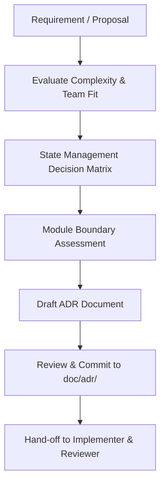

# Flutter Architecture Decisions

## Overview
The **Flutter Architecture Decisions** skill provides a rigorous framework for evaluating and selecting state management solutions (Riverpod, Bloc/Cubit, signals, or vanilla `setState`), establishing package/module boundaries, and recording Architecture Decision Records (ADRs). Working seamlessly across **Claude Code** and **Google Antigravity**, this skill complements `flutter-apply-architecture-best-practices` by making the explicit technical choices needed to prevent architecture thrashing and dependency rot.

## When to Use

### Trigger Scenarios
- Starting a new Flutter project or creating a major feature area with non-trivial state interactions.
- Choosing a state management paradigm (Riverpod vs. Bloc vs. signals) for a team or codebase.
- Splitting monolithic code into modular packages or distinct domain boundaries.
- Resolving architectural PR debates regarding state sharing, dependency injection, or persistence.

### When NOT to Use
- **One-widget fixes**: Local widget tweaks and styling adjustments should use standard `setState` without architecture debates.
- **Existing ADR coverage**: Features staying strictly within established module boundaries should follow existing project ADRs.
- **Backend or API design**: For backend services or non-Dart architecture, use `senior-architect-engineering`.

## Process



### 1. Apply the Layered Split
Ensure the codebase adheres to clear architectural separation:
- **UI Layer**: Widgets, presentation logic, theme styling.
- **Domain / Logic Layer**: Use cases, entities, value objects, business rules.
- **Data Layer**: Repositories, data sources, DTO mappers, network/local storage clients.

### 2. State Management Selection
Evaluate the state complexity against [references/state-management-decision-matrix.md](references/state-management-decision-matrix.md):
- Choose **one primary solution** per application.
- A secondary solution is acceptable only with documented rationale (e.g., local `setState` for ephemeral animation controllers alongside app-wide Riverpod).
- Avoid mixing three or more state libraries in the same codebase.

### 3. Module Boundary Evaluation
Apply the module boundary checklist. Only extract code into a standalone package if **two or more** conditions hold:
- Code is consumed by multiple independent applications or plugins.
- It changes for an isolated business reason or on a decoupled release cadence.
- It exposes a narrow, well-defined public API that can be summarized in one sentence.
- Its unit and integration test suites can execute without the host application.

### 4. Record Architecture Decision Record (ADR)
Document the decision using the template in [references/adr-template.md](references/adr-template.md):
- Store files under `doc/adr/NNNN-decision-title.md`.
- Capture context, considered options, positive consequences, tradeoffs, and compliance checks.

## Usage

### Example Prompts
```text
"Evaluate state management options for our Flutter ecommerce cart module and draft an ADR comparing Riverpod and Bloc."
```
```text
"Review whether the user authentication flow should be extracted into a separate Dart package."
```

### Host Execution Instructions
- **Claude Code**: Invoke via `/skill flutter-architecture-decisions` or request Flutter ADR analysis in chat.
- **Google Antigravity**: Invoke in architecture review mode or run automated module analysis:
```bash
dart analyze lib/
```

## Red Flags
- Selecting an overly complex state framework (e.g., enterprise Bloc) for simple static apps or leaf widgets.
- Adopting multiple overlapping state solutions (e.g., mixing Riverpod, Provider, and Bloc) across feature folders.
- Creating arbitrary "shared" or "core" packages without clear API boundaries or standalone test suites.
- Implementing architectural changes without committing a corresponding ADR to `doc/adr/`.
- Permitting UI widgets to directly call network or database clients without domain/repository abstraction.

## Verification
- [ ] Primary state management solution chosen and verified against project requirements.
- [ ] Module boundary checklist evaluated before extracting packages.
- [ ] ADR drafted using [references/adr-template.md](references/adr-template.md) and saved in `doc/adr/`.
- [ ] UI, domain, and data layer separation maintained with zero cyclic dependencies.
- [ ] Architectural decisions communicated to `flutter-implementer` and `flutter-reviewer`.

## References
- [State Management Decision Matrix](references/state-management-decision-matrix.md)
- [Architecture Decision Record (ADR) Template](references/adr-template.md)
