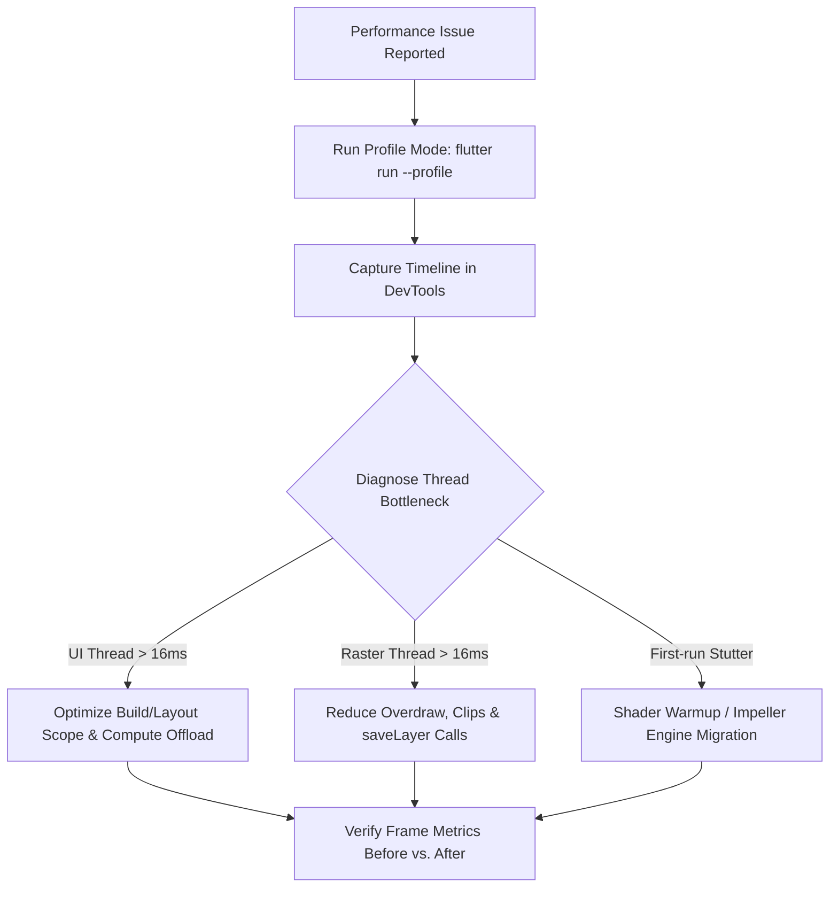

# Flutter Performance Profiling

## Overview
The **Flutter Performance Profiling** skill delivers rigorous diagnosis, instrumentation, and remediation workflows for Flutter runtime performance issues. Compatible across **Claude Code** and **Google Antigravity**, this skill guides developers to profile before optimizing—distinguishing UI thread bottlenecks (expensive widget trees, redundant layout computations) from raster thread stalls (shader warmup jank, excessive layer clipping, overdraw, expensive saveLayer calls) to ensure smooth 60fps / 120fps frame rates.

## When to Use

### Trigger Scenarios
- Investigating frame drops, stutter, or jank during scrolling and route transitions.
- Profiling and reducing cold/warm app startup latency.
- Diagnosing memory leaks, image bloat, or climbing heap allocations over extended sessions.
- Pre-release performance qualification for production releases.

### When NOT to Use
- **Layout overflow bugs**: For layout constraint violations and overflow render errors, use `flutter-fix-layout-issues`.
- **Backend or network latency**: For slow API queries or backend database bottlenecks, use `performance-scalability`.
- **Static code formatting**: For simple syntax formatting, use `dart format`.

## Process



### 1. Measure in Profile Mode (Never Guess)
Never attempt performance profiling in Debug mode (unoptimized JIT engine) or Release mode (stripped of DevTools hooks). Run in Profile mode:
```bash
flutter run --profile
flutter run --profile --trace-startup --verbose
```

### 2. Isolate the Thread Bottleneck in DevTools
Inspect the DevTools Performance timeline:
- **UI Thread (Dart Runtime)**: Frame budget exceeded (>16ms for 60fps, >8ms for 120fps). Indicates expensive `build()` logic, massive widget trees, or synchronous JSON parsing.
- **Raster Thread (GPU Engine)**: GPU rendering stalled. Indicates expensive `saveLayer()` invocations, heavy `BackdropFilter`, complex `ClipPath`/`ClipRRect`, or un-cached raster assets.
- **Shader Compilation**: Spikes appearing exclusively on the initial execution of an animation indicate shader compilation jank.

### 3. Apply Targeted Remediation
- **UI Thread Jank**: Narrow rebuild scopes with `const` constructors, use `ListView.builder`, and offload expensive parsing to background isolates via `compute()`.
- **Raster Thread Jank**: Replace dynamic `ClipRRect` with decorated `BoxDecoration(borderRadius: ...)`, wrap isolated animated subtrees with `RepaintBoundary`, and specify `cacheWidth`/`cacheHeight` on images.
- **Shader Jank**: Migrate to the Impeller rendering engine or warm up shaders via SkSL cache bundling.
- **Startup Latency**: Defer heavy synchronous initialization in `main()`, launching `runApp()` with a lightweight splash skeleton.

### 4. Continuous Regression Guardrails
- Record before-and-after frame timeline metrics in PR descriptions.
- Add integration benchmarks running in profile mode: `flutter test integration_test --profile`.

## Usage

### Profiling Commands
Launch profile execution and trace startup time:
```bash
flutter run --profile
flutter run --profile --trace-startup --verbose
```

Profile integration benchmarks:
```bash
flutter drive --profile --target=test_driver/perf.dart
```

### Example Prompts
```text
"Profile our Flutter catalog feed screen that experiences frame drops during rapid scrolling and isolate UI vs raster thread spikes."
```
```text
"Analyze our app startup timeline and identify blocking synchronous tasks before runApp."
```

### Host Execution Instructions
- **Claude Code**: Invoke via `/skill flutter-performance-profiling` or request runtime performance diagnosis.
- **Google Antigravity**: Execute profiling commands via terminal and capture trace metrics for analysis.

## Red Flags
- Profiling performance in Debug mode where assertions, debug banners, and JIT compilation skew frame metrics.
- Blindly wrapping widgets in `RepaintBoundary` without measuring GPU layer memory overhead.
- Parsing large JSON payloads directly on the UI isolate instead of using `compute()`.
- Decoding massive multi-megabyte images into tiny thumbnail avatar widgets without `cacheWidth`/`cacheHeight`.
- Speculative optimization without DevTools timeline verification.

## Verification
- [ ] Profiling performed strictly in `flutter run --profile` mode.
- [ ] DevTools Performance timeline inspected and thread bottleneck (UI vs Raster) identified.
- [ ] Frame build and raster times stay consistently under 16ms (60fps) / 8ms (120fps).
- [ ] Heavy CPU calculations offloaded to background isolates using `compute()`.
- [ ] Image assets set explicit memory dimensions (`cacheWidth`/`cacheHeight`).
- [ ] Before and after frame metrics documented in the review record.

## References
- [Jank-Hunting Playbook — Step by Step](references/jank-hunting-playbook.md)
