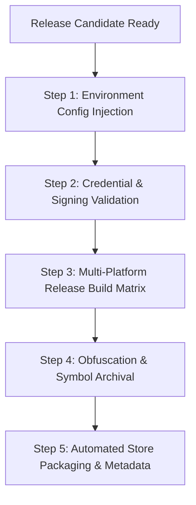

# Flutter Release Engineering

## Overview
The **Flutter Release Engineering** skill provides the complete deployment, packaging, and configuration lifecycle for Flutter applications across mobile (Android/iOS), web, and desktop. Operating across **Claude Code** and **Google Antigravity**, this skill guides teams through environment configuration injection (`--dart-define-from-file`), flavor schemes, secure app signing without in-repo credentials, reproducible CI build matrices, semver versioning, and over-the-air (OTA) patching via Shorebird.

## When to Use

### Trigger Scenarios
- Configuring environment flavors (dev, staging, production) and injecting configuration files.
- Setting up automated CI/CD build matrices for App Store (IPA), Google Play (AAB), Web, and Desktop.
- Establishing secure key signing pipelines for Android Keystores and Apple Provisioning Profiles.
- Evaluating and deploying over-the-air code patching (Shorebird) while managing store compliance.

### When NOT to Use
- **Day-to-day feature implementation**: Use `flutter-implementer` and official `flutter-*` skills for widget and domain coding.
- **Pure backend container builds**: For Docker or Cloud Run builds, use `build-and-ci-gates`.
- **Local code formatting**: Use `dart format` and `dart analyze`.

## Process



### 1. Environment Configuration
- Inject non-secret configuration variables using build-time definition files:
  `flutter build <target> --dart-define-from-file=config/prod.json`
- Access values in Dart via a typed `AppConfig` wrapping `String.fromEnvironment` and `bool.fromEnvironment`.
- Manage native variations (package IDs, bundle names, icons, Firebase configs) using Android product flavors and iOS schemes/xcconfig.
- **Never commit production secrets, service keys, or keystores into source control.** Store secrets strictly in CI encrypted stores.

### 2. Signing Security
- **Android**: Configure `key.properties` (git-ignored) with keystore paths injected via CI environment variables. Prefer Google Play App Signing.
- **iOS**: Manage signing identities and provisioning profiles via fastlane `match` or App Store Connect API keys in CI. Zero `.p12` files in the repository.
- Verify signature integrity on build artifacts before distribution (`apksigner verify`, `codesign -dv`).

### 3. Multi-Platform Build Matrix
Build from clean, pinned checkouts using Flutter Version Management (FVM):
- **Android App Bundle (Play Store)**:
  `flutter build appbundle --release --flavor prod --dart-define-from-file=config/prod.json`
- **Android APK (QA/Sideload)**:
  `flutter build apk --release --flavor staging --dart-define-from-file=config/staging.json`
- **iOS IPA (App Store)**:
  `flutter build ipa --release --flavor prod --export-options-plist=ios/exportOptions.plist --dart-define-from-file=config/prod.json`
- **Web**:
  `flutter build web --release --dart-define-from-file=config/prod.json`

### 4. Obfuscation & Crash Symbol Storage
Enable code obfuscation and split debug symbols:
`--obfuscate --split-debug-info=build/symbols`
Archive `build/symbols` in CI storage with release build tags for crash symbolication in Sentry or Firebase Crashlytics.

### 5. Versioning & Over-The-Air Updates
- Maintain `version: X.Y.Z+BUILD` in `pubspec.yaml`, setting `+BUILD` dynamically in CI via `--build-number=$CI_PIPELINE_IID`.
- Tag git releases (`vX.Y.Z`) following Conventional Commits.
- Evaluate Shorebird OTA patching only for Dart-level bug fixes; never bypass app store review for native modifications or permissions changes.

## Usage

### Build Commands & Matrix
Production Android release build:
```bash
flutter build appbundle --release --flavor prod --dart-define-from-file=config/prod.json --obfuscate --split-debug-info=build/symbols
```

Production iOS release build:
```bash
flutter build ipa --release --flavor prod --dart-define-from-file=config/prod.json --export-options-plist=ios/exportOptions.plist
```

### Example Prompts
```text
"Set up --dart-define-from-file configuration and product flavors for dev, staging, and prod in our Flutter repository."
```
```text
"Configure our CI GitHub Actions workflow to build release AAB and IPA artifacts with debug symbol archiving."
```

### Host Execution Instructions
- **Claude Code**: Invoke via `/skill flutter-release-engineering` or prompt for Flutter release/flavor setup.
- **Google Antigravity**: Run build and signing validation commands via terminal or integrate with release automation pipelines.

## Red Flags
- Hard-coding API URLs, backend endpoints, or environment flags in Dart source files.
- Committing Android `.jks`/`.keystore` files or iOS `.p12` certificates to git history.
- Manually incrementing build numbers in `pubspec.yaml` instead of driving monotonically in CI.
- Shipping release builds without stripping and archiving debug symbols.
- Using Shorebird OTA updates to push native permission or manifest changes.

## Verification
- [ ] No plaintext secrets or keys committed in source files or `pubspec.yaml`.
- [ ] Configuration separated cleanly across `config/*.json` and loaded via `--dart-define-from-file`.
- [ ] Production Android bundle (`.aab`) and iOS IPA (`.ipa`) build cleanly.
- [ ] Code obfuscation and split debug symbols generated and archived in `build/symbols`.
- [ ] Signing certificates verified with `apksigner` and `codesign`.
- [ ] Native flavors aligned between Android `build.gradle` and iOS Xcode schemes.

## References
- [Flavors, Config, and the AppConfig Pattern](references/flavors-and-config.md)
