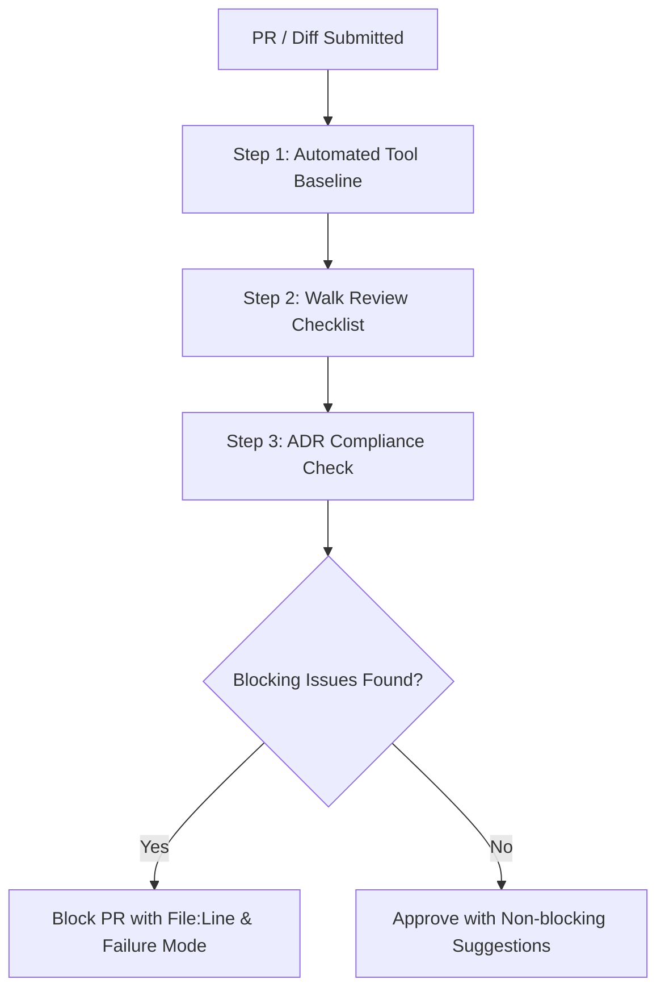

# Flutter Review Checklist

## Overview
The **Flutter Review Checklist** skill equips reviewers, tech leads, and autonomous agents with a systematic quality audit for Flutter and Dart codebases. Operating across **Claude Code** and **Google Antigravity**, this skill bridges the gap between static linter checks (`dart analyze`) and high-level architectural guidelines by detecting nuanced runtime hazards—such as wasteful widget rebuild trees, unclosed stream subscriptions, controller memory leaks, asynchronous `BuildContext` violations, missing accessibility semantics, and broken golden test coverage.

## When to Use

### Trigger Scenarios
- Conducting code reviews on Pull Requests that modify `lib/**` widgets, state controllers, or native platform channels.
- Auditing UI screens that experience frame drops, sluggish scrolling, or memory leaks.
- Preparing production release candidates for accessibility (a11y) and performance compliance.
- Verifying adherence to project-wide Architecture Decision Records (ADRs).

### When NOT to Use
- **Syntax and formatting errors**: Use `dart analyze` and `dart format` to catch routine formatting and analyzer issues.
- **Visual constraint layout bugs**: For `RenderFlex` overflow errors ("yellow-and-black stripes"), use `flutter-fix-layout-issues`.
- **Backend-only code**: For backend microservices or APIs, use `refactor-codebase` or `code-smells-expert`.

## Process



### 1. Tool Baseline
Run automated checks first to eliminate mechanical issues before starting manual or semantic review:
- Execute `dart analyze` and format checks.
- Execute test suites with coverage.
- Run the specialized Flutter project audit script to flag un-disposed resources and missing `const` constructors.

### 2. Walk the Review Checklist
Review diffs against [references/flutter-review-checklist.md](references/flutter-review-checklist.md), focusing on high-impact areas:
- **Rebuild Scope**: Ensure `setState` and reactive consumers target leaf widgets rather than entire scaffold screens.
- **Resource Lifecycle**: Confirm every `AnimationController`, `TextEditingController`, `StreamSubscription`, `FocusNode`, and `ScrollController` is closed in `dispose()`.
- **Async BuildContext**: Verify all usages of `context` after an `await` gap are guarded by `if (!mounted) return;`.
- **List & Image Performance**: Confirm `ListView.builder` or `CustomScrollView` is used for unbounded lists, and network images specify `cacheWidth`/`cacheHeight`.
- **Accessibility**: Ensure tap targets meet the 48x48dp minimum and icon buttons declare explicit semantics or tooltips.

### 3. Verify ADR Compliance
Check whether state management or module splits violate recorded ADRs in `doc/adr/`. Deviations require a dedicated ADR update, not casual review approval.

### 4. Provide Structured Verdict
Classify findings into:
- **Blocking**: Correctness bugs, resource leaks, accessibility regressions, or ADR violations.
- **Non-blocking**: Ergonomic recommendations, style suggestions, or optional micro-optimizations.

## Usage

### Commands & Automation Scripts
Execute the automated Flutter project audit script to scan for un-disposed controllers, missing mounted checks, and oversized widgets:
```bash
python3 ./skills/flutter-review-checklist/scripts/flutter_project_audit.py
```

Standard automated checks:
```bash
dart analyze
dart format --output=none --set-exit-if-changed .
flutter test --coverage
```

### Example Prompts
```text
"Review this Flutter PR for widget rebuild inefficiencies, memory leaks in controllers, and proper async context handling."
```
```text
"Run the Flutter project audit script on our codebase and report any unclosed stream subscriptions or missing dispose calls."
```

### Host Execution Instructions
- **Claude Code**: Invoke via `/skill flutter-review-checklist` or ask for Flutter code review in conversation.
- **Google Antigravity**: Run the audit script and analyzer commands via terminal or integrate with automated PR review workflows.

## Red Flags
- Calling `BuildContext` methods (`Navigator.of(context)`, `ScaffoldMessenger.of(context)`) after an `await` without verifying `mounted`.
- Instantiating controllers (`TextEditingController`, `AnimationController`) inside `build()` methods instead of `StatefulWidget` state.
- Forgetting to invoke `controller.dispose()` or `subscription.cancel()` in `dispose()`.
- Using `ListView(children: [...])` for lists with dynamic or unbounded length instead of `ListView.builder`.
- Omitting semantics labels or tooltips on custom interactive icon buttons.

## Verification
- [ ] Automated baseline passes: `dart analyze` and `dart format` return zero exit codes.
- [ ] Project audit script `python3 ./skills/flutter-review-checklist/scripts/flutter_project_audit.py` reports zero unhandled controller leaks.
- [ ] All `BuildContext` references across async gaps guarded with `mounted`.
- [ ] All controllers and subscriptions safely disposed.
- [ ] Accessibility semantics and tap target sizes verified.
- [ ] Changes adhere strictly to recorded ADRs in `doc/adr/`.

## References
- [Flutter Comprehensive Review Checklist](references/flutter-review-checklist.md)
