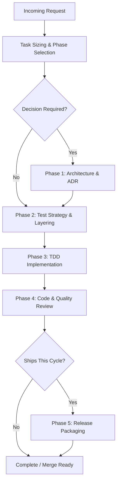

# Flutter Senior Orchestration

## Overview
The **Flutter Senior Orchestration** skill directs the end-to-end delivery lifecycle of Flutter and Dart applications—from initial task sizing and architectural decision-making through TDD implementation, comprehensive static/dynamic code review, and release packaging. Designed for seamless execution across both **Claude Code** and **Google Antigravity**, this skill sequences specialized subagents (`flutter-architect`, `flutter-implementer`, `flutter-reviewer`, and `flutter-release-engineer`) while delegating low-level mechanics to official `flutter-*` and `dart-*` skills.

## When to Use

### Trigger Scenarios
- Orchestrating new Flutter features, complex domain flows, or cross-cutting architectural changes.
- Sizing incoming technical tasks and selecting the minimal sufficient execution phases.
- Coordinating multi-agent workflows across architecture, testing, implementation, and release.
- Addressing systemic performance jank or planning major framework/dependency migrations.

### When NOT to Use
- **Direct code edits**: For trivial one-line text/padding fixes, delegate directly to implementation without full multi-agent orchestration.
- **Pure backend tasks**: For Python, Go, or database migrations, use language-specific skills like `python-expert` or `database-migration-expert`.
- **Ad-hoc layout tweaks**: For basic layout overflow errors, use official `flutter-fix-layout-issues`.

## Process



### 1. Task Sizing & Phase Selection
Before delegating work, size the task shape to avoid unnecessary ceremony:
- **One-widget fix (no logic/dep)**: Implement + targeted test. Skip architecture and release.
- **Small feature in existing module**: Light plan → Implement (TDD) → Review.
- **New feature area / new dependencies / module boundary**: Full pipeline (Architecture → Test → Implement → Review → Release).
- **SDK or major dependency bump**: `flutter-upgrade-migration` drives → Review + build matrix.
- **Jank / Stutter / Sluggishness**: `flutter-performance-profiling` drives → Review.

### 2. Phase 1: Architecture & ADR
- Delegated to `flutter-architect`.
- Uses layered boundaries (UI, domain/logic, data).
- Selects state management (Riverpod, Bloc, signals, or setState) using `flutter-architecture-decisions`.
- Records decisions in `doc/adr/` following standard ADR formats.

### 3. Phase 2: Test Strategy & Layering
- Delegated to `flutter-implementer` carrying `flutter-test-strategy`.
- Defines unit, widget, golden, and integration test coverage boundaries.
- Identifies mocking needs and ensures tests are placed at the lowest possible layer capable of catching failures.

### 4. Phase 3: TDD Implementation
- Delegated to `flutter-implementer` following strict Red-Green-Refactor cycles.
- Runs `dart analyze` and `dart format` continuously.
- Implements features against abstract repository/service interfaces.

### 5. Phase 4: Code & Quality Review
- Delegated to `flutter-reviewer` using `flutter-review-checklist`.
- Verifies widget rebuild scopes, lifecycle dispose methods, async BuildContext guards, and ADR compliance.
- Blocks only on correctness, memory leaks, accessibility violations, or architectural regressions.

### 6. Phase 5: Release Packaging
- Delegated to `flutter-release-engineer` using `flutter-release-engineering`.
- Manages `--dart-define-from-file`, flavor separation, app signing, and release build verification.

## Usage

### Example Prompts
```text
"Orchestrate the development of the checkout payment flow in Flutter, including state architecture, repository integration, and automated test coverage."
```
```text
"Size and execute the upgrade to Flutter 3.29 along with our core Riverpod dependencies."
```

### Host Execution Instructions
- **Claude Code**: Invoke via `/skill flutter-senior-orchestration` or request senior Flutter orchestration in the prompt.
- **Google Antigravity**: Invoke subagents using `invoke_subagent` with the role `flutter-feature-orchestrator`, or execute direct CLI analysis:
```bash
flutter analyze
flutter test
```

## Red Flags
- Defaulting to the full multi-agent pipeline for a single widget layout or text color change.
- Re-litigating state management or architecture patterns in PR comments without recording an ADR.
- Skipping task sizing and jumping straight into implementation without test plan definition.
- Committing secrets or production API keys in Dart code instead of `--dart-define-from-file`.
- Allowing `BuildContext` usage across asynchronous gaps without checking `mounted`.

## Verification
- [ ] Task sizing explicitly determined and documented before subagent dispatch.
- [ ] ADR recorded in `doc/adr/` for any new state management, module boundary, or core library choice.
- [ ] Unit and widget tests pass with zero analyzer warnings (`dart analyze`).
- [ ] Code formatted according to standard rules (`dart format --set-exit-if-changed .`).
- [ ] Review checklist verified for memory leaks, controller disposal, and accessibility tags.
- [ ] Release targets build successfully in staging/prod configurations without embedded secrets.
