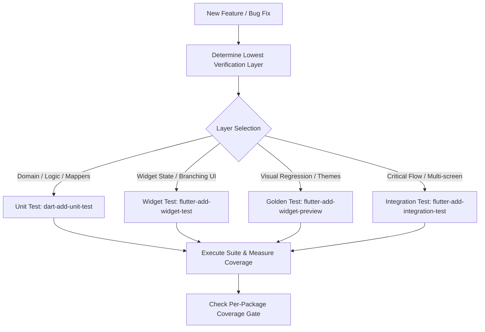

# Flutter Test Strategy

## Overview
The **Flutter Test Strategy** skill defines testing boundaries, coverage gates, and layer allocation across unit tests, widget tests, golden UI regression tests, and end-to-end integration tests. Functional across **Claude Code** and **Google Antigravity**, this skill guides engineers and agents to place tests at the lowest layer capable of catching failures, preventing bloated, brittle test suites while ensuring comprehensive verification of critical user journeys.

## When to Use

### Trigger Scenarios
- Designing the automated test architecture for a new Flutter application or feature module.
- Deciding whether a bug fix or feature requires a unit, widget, golden, or integration test.
- Establishing or calibrating CI code coverage thresholds and quality gates.
- Refactoring brittle UI tests into focused unit or widget specifications.

### When NOT to Use
- **Generating test mocks**: Use `dart-generate-test-mocks` for creating mock objects with Mockito or Mocktail.
- **Writing individual widget tests**: Use `flutter-add-widget-test` for concrete widget test implementation once the layer is chosen.
- **Non-Dart testing**: For backend Python test suites, use `test-driven-development` or `testing-expert`.

## Process



### 1. The Layering Rule
Test at the lowest layer that can catch the failure:
- **Unit Tests (`package:test`)**: Domain logic, data mappers, JSON serialization, state transitions of Notifiers/Blocs with fake repositories. Fast and isolated.
- **Widget Tests (`WidgetTester`)**: Widget rendering for given state models, UI branching (loading, empty, error, content), user interactions triggering state events.
- **Golden Tests**: Pixel-level rendering checks across device form factors, themes, and dynamic text scales.
- **Integration Tests (`integration_test/`)**: Real multi-screen user journeys executing on a simulator or device (e.g., login → checkout → confirmation).

### 2. Mandatory Test Coverage Rules
Every PR must include:
- Unit tests for any new or modified domain business logic.
- Widget tests for any widget displaying multiple UI states or conditional branching.
- Regression tests reproducing reported bugs before code fixes are applied.
- Integration test updates for critical business-critical funnels (auth, payments).

### 3. Exclusions from Dedicated Tests
Avoid wasting effort testing:
- Generated code (`*.g.dart`, `*.freezed.dart`, `*.gr.dart`).
- Pass-through getters and trivial property assignments.
- Third-party package implementations that are merely configured.

### 4. Coverage Gate Enforcement
- Measure line coverage per package: `flutter test --coverage`.
- Exclude generated code files from coverage denominators using `lcov --remove`.
- Enforce strict coverage ratchet rules: thresholds must stay steady or increase, never decrease.

## Usage

### Commands & Execution
Run test suites with coverage generation:
```bash
flutter test --coverage
```

Filter coverage reports excluding generated files:
```bash
lcov --remove coverage/lcov.info '*.g.dart' '*.freezed.dart' -o coverage/filtered.info
genhtml coverage/filtered.info -o coverage/html
```

### Example Prompts
```text
"Determine the testing strategy and required test kinds for our new biometric authentication screen in Flutter."
```
```text
"Define the per-package coverage gates and exclusions for our Flutter multi-module repository."
```

### Host Execution Instructions
- **Claude Code**: Invoke via `/skill flutter-test-strategy` or prompt for Flutter testing guidance.
- **Google Antigravity**: Run `flutter test` via terminal or delegate test generation to `flutter-implementer` subagent.

## Red Flags
- Testing pure layout styling or simple `Padding` wrappers with costly integration tests.
- Inflating test counts by writing unit tests for generated `freezed` or `json_serializable` classes.
- Allowing global repository coverage metrics to hide un-tested critical domain packages.
- Committing bug fixes without adding a failing regression test first.
- Relying exclusively on end-to-end integration tests while skipping unit and widget tests.

## Verification
- [ ] Every new domain class or state notifier has corresponding unit test coverage.
- [ ] Branching UI states (loading, error, empty, data) verified via widget tests.
- [ ] Per-package coverage threshold meets or exceeds established project gate.
- [ ] Generated files (`*.g.dart`, `*.freezed.dart`) excluded from coverage metrics.
- [ ] All tests execute and pass cleanly without flaky asynchronous failures.

## References
- [Deciding the Layer — Worked Examples](references/test-pyramid-flutter.md)
