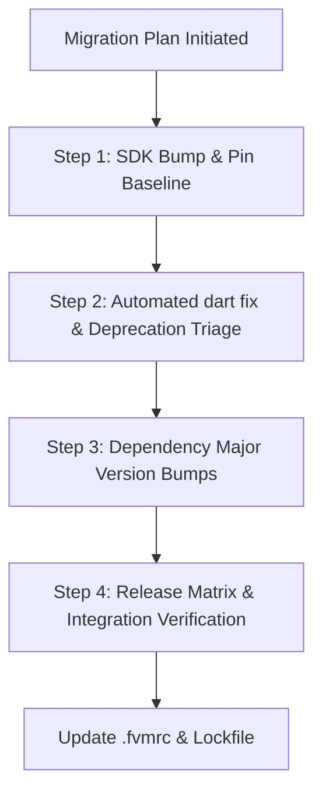

# Flutter Upgrade & Migration

## Overview
The **Flutter Upgrade & Migration** skill establishes an ordered, risk-mitigated strategy for upgrading Flutter and Dart SDK versions, migrating breaking dependency majors, and systematically clearing codebase-wide deprecation warnings. Working across **Claude Code** and **Google Antigravity**, this skill structures major migrations into isolated, reviewable commits—preventing long-running broken branches and untangling dependency solver deadlocks.

## When to Use

### Trigger Scenarios
- Upgrading to a new Flutter stable milestone (e.g., 3.24 → 3.27 → 3.29).
- Bumping core dependencies across major breaking versions (e.g., GoRouter, Riverpod, Dio).
- Clearing accumulated deprecation warnings across a large multi-module codebase.
- Resolving transitive package version dependency conflicts during `flutter pub get`.

### When NOT to Use
- **Automatic single-file lint fixes**: Use `dart fix` or `dart-run-static-analysis` for local automated fixes.
- **Trivial patch version updates**: Routine minor bug fix dependency bumps (`^1.2.3` to `^1.2.4`) should proceed without full migration planning.
- **Python or backend upgrades**: For Python version transitions or library upgrades, use `python-expert` or `managing-python-dependencies`.

## Process



### 1. Upgrade Principles
- **One Axis at a Time**: Never bundle an SDK upgrade, major dependency upgrades, and linter rule changes into a single PR.
- **Pin Before Starting**: Commit a green `pubspec.lock` and record the baseline Flutter version (`flutter --version` / `.fvmrc`).
- **Tests as Safety Net**: Ensure test suites pass before touching dependencies.

### 2. Step 1 — SDK Upgrade Sweep
```bash
git switch -c chore/flutter-<version>
flutter --version
flutter upgrade
flutter pub get
dart analyze
flutter test
```
- Review official Flutter and Dart release notes for breaking API changes.
- Apply minimal fixes required to achieve a clean compilation and passing test suite.

### 3. Step 2 — Mechanical Deprecation Fixes
```bash
dart fix --dry-run
dart fix --apply
dart format .
dart analyze
```
- Categorize remaining deprecations:
  - Few warnings: Fix immediately within the upgrade PR.
  - Dozens on one API: Fix in a single dedicated follow-up PR.
  - Hundreds across multiple APIs: Create tracked migration tickets and address progressively.

### 4. Step 3 — Dependency Major Bumps
- Audit outdated packages: `flutter pub outdated`.
- Upgrade dependencies individually by blast radius (e.g., authentication or state libraries before utility packages).
- Resolve package constraint conflicts using `dart-resolve-package-conflicts`.

### 5. Step 4 — Verification Sweep
- Verify analyzer status: `dart analyze` returns zero issues.
- Run full test suite: `flutter test` and critical journey integration tests.
- Verify native release builds per `flutter-release-engineering` matrix (Gradle/AGP, Xcode, Impeller).

## Usage

### Migration Commands
Review outdated dependencies:
```bash
flutter pub outdated
```

Perform automated codemods:
```bash
dart fix --dry-run
dart fix --apply
```

Execute static verification and tests:
```bash
dart analyze
flutter test
```

### Example Prompts
```text
"Plan and execute the migration of our Flutter project to Flutter 3.29, isolating the SDK upgrade from Riverpod 3 breaking changes."
```
```text
"Triage deprecation warnings across our Flutter app and run automated dart fix repairs."
```

### Host Execution Instructions
- **Claude Code**: Invoke via `/skill flutter-upgrade-migration` or prompt for Flutter SDK/dependency migration.
- **Google Antigravity**: Run upgrade and analysis commands via terminal or coordinate via `flutter-feature-orchestrator`.

## Red Flags
- Bundling an SDK upgrade, multiple major dependency bumps, and linter migrations into a single massive PR.
- Upgrading Flutter or dependencies on a branch with existing failing tests.
- Blindly editing version constraints in `pubspec.yaml` with `any` instead of resolving dependency trees properly.
- Ignoring native build breakage (Android Gradle Plugin, CocoaPods, Xcode signing) until release day.
- Suppressing deprecation warnings globally instead of addressing or ticketing them.

## Verification
- [ ] Baseline Flutter version recorded and `pubspec.lock` committed prior to upgrade.
- [ ] SDK upgrade isolated in a dedicated commit or PR.
- [ ] Automated `dart fix --apply` executed and results formatted with `dart format`.
- [ ] `flutter pub outdated` reviewed and major dependency bumps handled in isolation.
- [ ] `dart analyze` and `flutter test` pass with zero failures.
- [ ] Release builds verified across Android and iOS target matrices.
