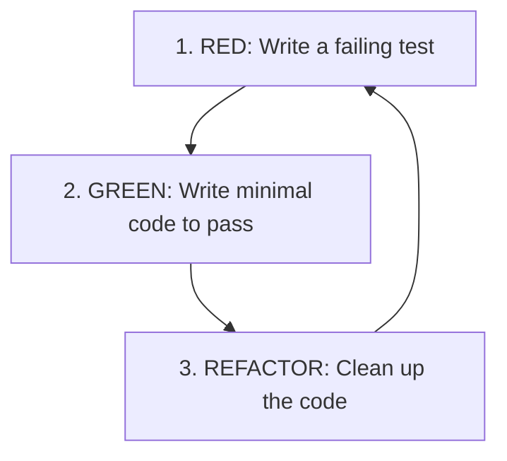

# Test-Driven Development & Testing Patterns Reference

This reference outlines patterns, practices, and rules for writing robust test suites to support clean code and refactoring.

---

## 1. The TDD Cycle (Red-Green-Refactor)

TDD requires writing code in three distinct phases:



1. **RED**: Write a unit test that expresses the desired behavior. Run the test and watch it fail (proving the test is valid and not passing by accident).
2. **GREEN**: Write the absolute minimum implementation code to make the test pass. Do not write extra features or clean code yet.
3. **REFACTOR**: Clean up both the implementation and the test code. Remove duplication, extract methods, rename variables. Ensure the tests stay **GREEN** after every step.

---

## 2. Test Structure: AAA Pattern (Arrange-Act-Assert)

Keep tests clean, readable, and structured by separating them into three blocks:

```python
def test_calculate_total_with_discount():
    # 1. ARRANGE: Set up the inputs, state, and mocks
    cart = ShoppingCart()
    cart.add_item(Item("Book", price=10.0), quantity=2)
    coupon = DiscountCoupon(percentage=10)
    
    # 2. ACT: Execute the target behavior
    total = cart.calculate_total(coupon)
    
    # 3. ASSERT: Verify the outcome is correct
    assert total == 18.0
```

---

## 3. Levels of Testing

### 3.1 Unit Testing
- **Scope**: A single function, method, or class in isolation.
- **Dependencies**: No databases, file systems, network queries, or external APIs. All external dependencies must be mocked.
- **Speed**: Extremely fast (milliseconds).

### 3.2 Integration Testing
- **Scope**: The integration between multiple components (e.g. database query executions, middleware flows, config integrations).
- **Dependencies**: Real or lightweight local databases (e.g., SQLite in-memory, Docker containers) are allowed. External networks should still be mocked/stubbed.

### 3.3 End-to-End (E2E) / System Testing
- **Scope**: User journeys traversing the entire system (Frontend -> API Server -> DB).
- **Tooling**: Playwright, Cypress, Selenium.

---

## 4. Mocking & Test Isolation

### 4.1 Mocking vs. Stubbing
- **Stub**: Replaces a dependency and returns static values (e.g., `get_user` always returns a mock user object).
- **Mock**: Registers interactions. You assert that the mock was called with specific arguments and a specific number of times.

### 4.2 Pytest Mocking Example
```python
def test_send_welcome_email(mocker):
    # Mock the external SMTP mail client
    mock_email_client = mocker.patch("app.services.email_client.send")
    
    user = User("John Doe", "john@example.com")
    register_user(user)
    
    # Assert the client was called with correct parameters
    mock_email_client.assert_called_once_with(
        to="john@example.com",
        subject="Welcome!",
        body=mocker.ANY
    )
```

---

## 5. Testing Anti-Patterns

- **Asserting Internals**: Testing private variables or private methods instead of public APIs. This makes tests fragile when refactoring.
- **Shared State**: Tests that depend on the execution order of other tests. Ensure databases are cleaned/rolled back after each test runs.
- **Slow Test Suites**: Putting sleep statements (`time.sleep`) in tests. Use virtual timers or mock the clocks instead.
