# Master Execution Plan — Cancun DashBooth

> **Proyecto:** Cancun DashBooth (FlutterConf LATAM 2026)  
> **Objetivo:** Aplicación Flutter Web interactiva para captura de selfies, transformación multimodal directa con Firebase AI (`gemini-3.1-flash-image`), credenciales oficiales con `#flutterconflatam26` y mural de fotos en tiempo real respaldado por Firebase (Firestore `UserCards` + Firebase Storage) bajo una estrategia **Zero-Auth**.  
> **Condición de Parada (Gate):** `dart analyze --fatal-infos` con **0 issues**, tests unitarios y de widgets pasando al 100% y cero dependencias de `dart:io`.

---

## Matriz de Fases y Tareas Atómicas

```mermaid
flowchart LR
    F1["Fase 1\nScaffolding & Theme"] --> F2["Fase 2\nDomain & Contratos"]
    F2 --> F3["Fase 3\nData & Firebase"]
    F3 --> F4["Fase 4\nRiverpod Providers"]
    F4 --> F5["Fase 5\nUI Widgets & Screens"]
    F5 --> F6["Fase 6\nGates & Web Build"]
    F6 --> F7["Fase 7\nBadge & Branding"]
    F7 --> F8["Fase 8\nFirebase AI & Dash"]
    F8 --> F9["Fase 9\nDual-Channel & Prompt"]
    F9 --> F10["Fase 10\nRuleta & Podio F1"]
    F10 --> F11["Fase 11\nCuota IA & Post-Publish"]
    F11 --> F12["Fase 12\nRestauración & Instagram"]
    F12 --> F13["Fase 13\nResponsive & Zero-Fake-Data"]
    F13 --> F14["Fase 14\nLab & Flutter Playbook"]
    F14 --> F15["Fase 15\nDeploy Firebase Hosting"]
```

---

### Fase 1: Aprovisionamiento de Firebase, Scaffolding Web y Sistema de Diseño Base
- [x] **1.1. Aprovisionamiento del Proyecto Firebase `DashBooth` & Servicios Cloud**:
  - Crear un nuevo proyecto en Firebase llamado `DashBooth` (`dashbooth-cancun-2026`).
  - Habilitar el servicio de **Cloud Firestore** (base de datos nativa en `us-central1` creada).
  - Habilitar el servicio de **Firebase Storage** (bucket `dashbooth-cancun-2026-user-cards` aprovisionado).
  - Habilitar el servicio de **Firebase AI Logic** (activando Gemini Developer API / `generativelanguage.googleapis.com`).
  - Registrar la aplicación Web de Flutter en Firebase (`DashBooth Web` - `1:1084274811775:web:8ceddb133a5eccc570704a`).
  - Generar el archivo de configuración oficial [`lib/firebase_options.dart`](file:///Users/jggomez/Documents/jggomez/code/workshop-flutter-ia/lib/firebase_options.dart).
  - Desplegar las reglas iniciales de seguridad de [`firestore.rules`](file:///Users/jggomez/Documents/jggomez/code/workshop-flutter-ia/firestore.rules) y [`storage.rules`](file:///Users/jggomez/Documents/jggomez/code/workshop-flutter-ia/storage.rules).
- [x] **1.2. Inicialización de Flutter Web**:
  - Ejecutar `flutter create . --platforms=web --project-name=cancun_dashbooth --org=latam.flutterconf`.
  - Configurar `web/index.html` con título oficial, meta tags y soporte CanvasKit/Wasm.
- [x] **1.3. Configuración de `pubspec.yaml`**:
  - Declarar dependencias requeridas en [`docs/tech-stack.md`](file:///Users/jggomez/Documents/jggomez/code/workshop-flutter-ia/docs/tech-stack.md):
    `flutter_riverpod: ^2.6.1`, `firebase_core: ^3.10.0`, `cloud_firestore: ^5.6.0`, `firebase_storage: ^12.4.0`, `firebase_ai: ^2.3.0`, `image_picker: ^1.1.2`, `image: ^4.5.2`, `shimmer: ^3.0.0`, `universal_html: ^2.2.4`, `uuid: ^4.5.1`, `google_fonts: ^6.2.1`.
  - Configurar `dev_dependencies`: `flutter_test`, `flutter_lints: ^5.0.0`, `mocktail: ^1.0.4`.
  - Ejecutar `flutter pub get` exitosamente.
- [x] **1.4. Estructura de Capas Clean Architecture**:
  - Crear el árbol de directorios desacoplado:
    - `lib/domain/entities/`, `lib/domain/repositories/`, `lib/domain/usecases/`
    - `lib/data/datasources/`, `lib/data/models/`, `lib/data/repositories/`
    - `lib/presentation/theme/`, `lib/presentation/providers/`, `lib/presentation/screens/`, `lib/presentation/widgets/`, `lib/presentation/utils/`
- [x] **1.5. Implementación del Tema y Tokens de Diseño ([`docs/ui-ux-design.md`](file:///Users/jggomez/Documents/jggomez/code/workshop-flutter-ia/docs/ui-ux-design.md))**:
  - `lib/presentation/theme/app_colors.dart`: Paleta Flutter (`flutterBlue`, `flutterSkyBlue`, `dashCyan`, `caribbeanTeal`, `sunshineAmber`, `bgDark`, `surfaceDark`).
  - `lib/presentation/theme/app_gradients.dart`: Gradientes `flutterPrimary`, `carribeanDash`, `ambientGlow`.
  - `lib/presentation/theme/app_theme.dart`: Configuración de `ThemeData.dark()` con Material 3 y `GoogleFonts.poppins`.

---

### Fase 2: Capa de Dominio (100% Dart Puro & TDD)
- [x] **2.1. Entidades Inmutables de Dominio**:
  - `lib/domain/entities/badge_draft.dart`: Entidad con `attendeeName`, `attendeeEmail`, `rawPhotoBytes` (`Uint8List`), `createdAt`.
  - `lib/domain/entities/user_card.dart`: Entidad con `id`, `name`, `email`, `imageUri`, `createdAt`.
- [x] **2.2. Contratos e Interfaces de Repositorios**:
  - `lib/domain/repositories/i_camera_service.dart`: `Future<Uint8List?> captureSelfie()`, `Future<Uint8List?> pickImageFromGallery()`.
  - `lib/domain/repositories/i_ai_badge_service.dart`: `Future<Uint8List> generateDashBadge({required Uint8List photoBytes, required String attendeeName})`.
  - `lib/domain/repositories/i_user_card_repository.dart`:
    - `Future<String> uploadBadgeImage({required Uint8List imageBytes, required String cardId})`
    - `Future<void> createUserCard(UserCard userCard)`
    - `Stream<List<UserCard>> streamCommunityCards()`
- [x] **2.3. Casos de Uso de Negocio**:
  - `lib/domain/usecases/generate_ai_badge_usecase.dart`: Orquesta la llamada a IA y maneja validación de bytes.
  - `lib/domain/usecases/publish_user_card_usecase.dart`: Orquesta subida a Storage, obtención de `imageUri` y registro en `UserCards`.
  - `lib/domain/usecases/get_community_stream_usecase.dart`: Retorna el stream reactivo de credenciales.
- [x] **2.4. Pruebas Unitarias de Dominio**:
  - `test/domain/entities/badge_draft_test.dart` y `user_card_test.dart`.
  - `test/domain/usecases/generate_ai_badge_usecase_test.dart`.
  - `test/domain/usecases/publish_user_card_usecase_test.dart`.
  - `test/domain/usecases/get_community_stream_usecase_test.dart`.
  - *Gate de fase:* `flutter test test/domain/` (14 pruebas pasando al 100%).

---

### Fase 3: Capa de Datos e Infraestructura (Firebase & Web Services)
- [x] **3.1. Servicio de Captura Web (`CameraService`)**:
  - `lib/data/datasources/camera_service_impl.dart`: Implementación con `image_picker` retornando bytes en memoria (`Uint8List`) sin tocar `dart:io`.
- [x] **3.2. DataSource de Firebase AI Logic (`gemini-3.1-flash-image`) Multimodal**:
  - `lib/data/datasources/ai_badge_remote_datasource.dart`:
    - Invocación multimodal vía `FirebaseAI.googleAI().generativeModel(model: 'gemini-3.1-flash-image', generationConfig: GenerationConfig(responseModalities: [ResponseModalities.text, ResponseModalities.image]))`.
    - Generación directa de imagen ilustrada con Dash en Cancún (`InlineDataPart`) y título de vibra caribeña (`TextPart`).
    - Timeout estricto de 15 segundos y catálogo de fallback limpio preservando la fotografía original del asistente.
- [x] **3.3. DataSource de Firebase Storage**:
  - `lib/data/datasources/firebase_storage_datasource.dart`:
    - Subida a `user_cards/{cardId}.png` con `SettableMetadata(contentType: 'image/png')`.
    - Retorno de la URL pública de descarga (`getDownloadURL()`).
- [x] **3.4. DataSource de Cloud Firestore (`UserCards`)**:
  - `lib/data/datasources/firestore_user_cards_datasource.dart`:
    - Guardar documento en colección `UserCards`.
    - Stream ordenado por `createdAt` desc: `collection('UserCards').orderBy('createdAt', descending: true).snapshots()`.
- [x] **3.5. Modelos y Mappers DTO**:
  - `lib/data/models/user_card_model.dart`: Serialización `fromFirestore(DocumentSnapshot)`, `toFirestore()`, `toJson()`.
- [x] **3.6. Implementación de Repositorios**:
  - `lib/data/repositories/user_card_repository_impl.dart`.
  - `lib/data/repositories/ai_badge_service_impl.dart`.
- [x] **3.7. Pruebas Unitarias de Datos (Mocks con `mocktail`)**:
  - `test/data/models/user_card_model_test.dart`.
  - `test/data/repositories/user_card_repository_impl_test.dart`.
  - `test/data/datasources/camera_service_impl_test.dart`.
  - *Gate de fase:* `flutter test test/data/` (Todas las pruebas pasando al 100%).

---

### Fase 4: Estado Reactivo con Riverpod (Presentation Providers)
- [x] **4.1. Proveedor de Registro & Captura**:
  - `lib/presentation/providers/badge_draft_provider.dart`: `StateNotifier` o `Notifier` con estado inmutable `BadgeDraftState` (nombre, email, foto original, estado de validación).
- [x] **4.2. Proveedor de Transformación de IA**:
  - `lib/presentation/providers/ai_generation_provider.dart`: `AsyncNotifier<Uint8List?>` que gestiona el estado de carga, mensajes dinámicos de Dash y resultado procesado.
- [x] **4.3. Proveedor de Publicación de Credencial**:
  - `lib/presentation/providers/card_publish_provider.dart`: `AsyncNotifier<UserCard?>` que gestiona subida a Storage y persistencia en Firestore.
- [x] **4.4. Proveedor del Mural en Vivo**:
  - `lib/presentation/providers/community_wall_provider.dart`: `StreamProvider<List<UserCard>>` conectado a `IUserCardRepository.streamCommunityCards()`.
- [x] **4.5. Pruebas Unitarias de Providers**:
  - `test/presentation/providers/badge_draft_provider_test.dart`.
  - `test/presentation/providers/ai_generation_provider_test.dart`.
  - `test/presentation/providers/card_publish_provider_test.dart`.
  - `test/presentation/providers/community_wall_provider_test.dart`.
  - *Gate de fase:* `flutter test test/presentation/providers/` (100% pasando).

---

### Fase 5: Componentes UI & Pantallas (Material 3 + Glassmorphism)
- [x] **5.1. Componentes Atómicos y Reutilizables**:
  - `lib/presentation/widgets/glass_container.dart`: Contenedor con `BackdropFilter` y bordes sutiles en cian.
  - `lib/presentation/widgets/name_email_form.dart`: Inputs estilizados con validación instantánea y bordes brillantes.
  - `lib/presentation/widgets/camera_viewfinder.dart`: Visor vertical 4:5 con retícula sutil y botones de captura/subida.
  - `lib/presentation/widgets/ai_processing_indicator.dart`: Loader con avatar animado de Dash, barra tropical y ticker dinámico de mensajes.
  - `lib/presentation/widgets/official_badge_card.dart`: Tarjeta credencial oficial con banner de FlutterConf LATAM Cancún, tipografía destacada, etiqueta *"Flutter Pioneer"* y clave de `RepaintBoundary`.
  - `lib/presentation/widgets/community_badge_item.dart`: Tarjeta compacta para el grid con animación de entrada y evento tap.
  - `lib/presentation/widgets/badge_detail_modal.dart`: Diálogo de zoom al pulsar sobre un badge del mural.
- [x] **5.2. Utilidad Web de Descarga**:
  - `lib/presentation/utils/web_image_downloader.dart`: Rasterización con `RepaintBoundary.toImage(pixelRatio: 2.0)` y disparo de descarga nativa mediante Blob de navegador (`universal_html`).
- [x] **5.3. Pantallas Principales**:
  - `lib/presentation/screens/photobooth_screen.dart`: Flujo de 3 pasos (1. Formulario & Cámara -> 2. Inferencia IA con Dash -> 3. Credencial lista con botón de Descarga HD y opción de publicar en mural).
  - `lib/presentation/screens/community_wall_screen.dart`: Galería en tiempo real con GridView fluido, estados de skeleton shimmer y modal de inspección.
  - `lib/presentation/screens/main_home_screen.dart`: Tab bar superior moderna ("Crear mi Badge" / "Mural en Vivo").
- [x] **5.4. Pruebas de Widgets (`WidgetTester`)**:
  - `test/presentation/widgets/official_badge_card_test.dart`.
  - `test/presentation/widgets/name_email_form_test.dart`.
  - `test/presentation/screens/photobooth_screen_test.dart`.
  - `test/presentation/screens/community_wall_screen_test.dart`.
  - `test/widget_test.dart`.
  - *Gate de fase:* `flutter test test/presentation/` (100% pasando).

---

### Fase 6: Verificación Sensorial, Reglas de Firebase & Build Web
- [x] **6.1. Verificación de Reglas de Firebase**:
  - Validar sintaxis y alcance de [`firestore.rules`](file:///Users/jggomez/Documents/jggomez/code/workshop-flutter-ia/firestore.rules) y [`storage.rules`](file:///Users/jggomez/Documents/jggomez/code/workshop-flutter-ia/storage.rules).
- [x] **6.2. Auditoría de Estilo y Calidad**:
  - Ejecutar `dart analyze --fatal-infos` -> **0 errores / 0 advertencias** (Aprobado).
  - Ejecutar suite completa `flutter test` -> **100% pasando** (40/40 pruebas pasando).
  - Validar ausencia total de imports de `dart:io` (100% Web-Safe).
- [x] **6.3. Compilación de Producción Web**:
  - Ejecutar `flutter build web --release` y verificar generación correcta de bundles en `build/web/` (Compilación exitosa).
- [x] **6.4. Verificación Sensorial en Navegador**:
  - Web app abierta en Google Chrome / DevTools, validando pestañas de navegación ("Crear mi Badge" y "Mural en Vivo"), componentes visuales, glassmorphism y flujos reactivos.

---

### Fase 7: Refinamiento de Credencial y Branding de Conferencia
- [x] **7.1. Depuración y Limpieza Visual de la Credencial (`OfficialBadgeCard`)**:
  - Remover la mención a *Firebase AI • Gemini 3.1* en el pie de la credencial.
  - Actualizar el hashtag oficial del evento a `#flutterconflatam26`.
  - Completado por subagente: `flutter-implementer`.
- [x] **7.2. Cobertura de Pruebas de Widgets**:
  - Actualizar `test/presentation/widgets/official_badge_card_test.dart` para validar `#flutterconflatam26` y la remoción de la marca de IA (TDD Red-Green).
- [x] **7.3. Quality Gate y Recompilación**:
  - `flutter analyze` y `flutter test` aprobados al 100% (40/40 tests verdes).

---

### Fase 8: Integración Real de Firebase AI (gemini-3.1-flash-image Multimodal)
- [x] **8.1. Integración Oficial de Gemini Multimodal en Firebase AI**:
  - Invocación en `AiBadgeRemoteDataSource` al modelo `gemini-3.1-flash-image` con `generationConfig: GenerationConfig(responseModalities: [ResponseModalities.text, ResponseModalities.image])`.
  - Envío de selfie como `InlineDataPart('image/jpeg', photoBytes)` con prompt de transformación ilustrada junto a Dash en Cancún y título de vibra caribeña.
  - Catálogo de títulos caribeños de fallback limpio y resiliente ante timeouts o modo offline.
- [x] **8.2. Generación Directa de Imagen por IA**:
  - Extracción directa de los bytes de imagen generados por la IA (`InlineDataPart`) para `AiBadgeResult.imageBytes`.
  - Eliminación de cajas y estampados superpuestos; la IA genera la ilustración de forma integral.
  - Retorno limpio de la foto original sin alteraciones en caso de fallback.
- [x] **8.3. Reflejo de AI Vibe en la Credencial Oficial**:
  - `BadgeDraft` y `AiGenerationState` enriquecidos con `aiVibeTitle`.
  - Despliegue del título en `OfficialBadgeCard` con etiqueta brillante `✨ IA Vibe: ...` e icono `Icons.auto_awesome`.
- [x] **8.4. Pruebas y Aprobación de Calidad**:
  - 50/50 tests automatizados aprobados (100% pasando).
  - `dart analyze --fatal-infos` con 0 issues.
  - `dart format` aplicado a todo el código.
  - Completado por subagente: `flutter-implementer`.

---

### Fase 9: Resiliencia API (401 App Check) y Perfeccionamiento de UI/UX de IA Vibe
- [x] **9.1. Diagnóstico y Fallback para Error 401 (Unauthorized) de Firebase Vertex AI**:
  - **Causa:** En Web (`http://localhost:8080`), las peticiones a `firebasevertexai.googleapis.com` requieren un token de Firebase App Check (`X-Firebase-AppCheck`). Sin App Check configurado en el navegador de desarrollo, la llamada retorna 401 Unauthorized.
  - **Solución implementada:** Se integró un fallback directo a la REST API de Google AI Gemini Developer (`https://generativelanguage.googleapis.com/v1beta/models/gemini-3.1-flash-image:generateContent?key=$apiKey`). Este endpoint utiliza la API Key directamente, no exige App Check, y responde exitosamente generando la imagen multivariada (Dash + Caribe) y el texto.
- [x] **9.2. Optimización de Frases y Títulos de IA Vibe (Frases Mexicanas y Regionales de Cancún/Yucatán)**:
  - Se ajustó el prompt del modelo para requerir explícitamente frases mexicanas auténticas y referencias regionales a Cancún, Quintana Roo y Yucatán (ej: "¡Qué Chido Cancún! 100%", "Bomba Yucateca de Código", "Vibra Maya Sagrada 99%", "Kukulcán del Hot Reload", "¡Qué Padre la Riviera Maya!", "Marquesita & Widgets 100%").
  - Se renovó el catálogo de fallback con títulos de identidad mexicana y peninsular para cuando se opera offline.
- [x] **9.3. Rediseño de la Píldora IA Vibe en `OfficialBadgeCard`**:
  - Se eliminó el emoji `✨` duplicado en el texto, manteniendo el icono oficial `Icons.auto_awesome`.
  - Se habilitó `maxLines: 2`, `softWrap: true` y `maxWidth: 290` con tipografía de 11px semi-bold, asegurando que el texto se adapte perfectamente sin ser cortado por elipsis.
- [x] **9.4. Suite de Pruebas y Calidad de Producción**:
  - 51/51 tests automatizados aprobados (100% pasando).
  - `dart analyze --fatal-infos` con 0 issues.
  - `flutter build web --release` generado.
- [x] **9.5. Refinamiento de Prompt en Inglés y Eliminación de Lenguaje Técnico de Usuario**:
  - Se estructuró el prompt de generación en inglés siguiendo las mejores prácticas de ingeniería de prompts para modelos de difusión/imagen de Google (*Subject, Character Anchoring, Environment, Style, Lighting, Mood*).
  - Se eliminó cualquier referencia técnica de infraestructura ("Subiendo a Storage & Firestore...") en la UI, reemplazándola por copy centrado en el usuario: *"Compartiendo en el Mural..."* y confirmación *"¡Publicado en el Mural!"*.

---

### Fase 10: Sorteo de Premios con Ruleta y Podio de Fórmula 1 en el Mural
- [x] **10.1. Componente Modal de Ruleta F1 (`F1RouletteDialog`)**:
  - Implementación con máquina de estados (`ready`, `spinning`, `podium`).
  - Semáforo de salida de Fórmula 1 con 5 luces rojas secuenciadas.
  - Ruleta desacelerada con selección aleatoria de 3 ganadores del mural sin repetición.
  - Podio clásico de F1 en 3 niveles con animación elástica de revelación:
    - **P1 (Oro, Centro - 170px):** Trofeo 🏆, corona de laureles y avatar con resplandor dorado.
    - **P2 (Plata, Izquierda - 120px):** Trofeo 🥈 y pedestal plateado.
    - **P3 (Bronce, Derecha - 90px):** Trofeo 🥉 y pedestal cobrizo.
- [x] **10.2. Integración en `CommunityWallScreen`**:
  - Botón de acción responsive en la cabecera *"🏎️ Ruleta F1 Premios"* con gradiente rojo carrera y apertura de modal.
- [x] **10.3. Pruebas Automatizadas y Calidad**:
  - 55/55 pruebas unitarias y de widgets aprobadas (100% pasando).
  - `dart analyze --fatal-infos` con 0 issues.
  - `flutter build web --release` generado con éxito.

---

### Fase 11: Protección de Cuota IA, Bloqueo Post-Publicación y Rediseño de Flujo de Nueva Credencial
- [x] **11.1. Bloqueo de Formulario y Protección contra Gasto Innecesario de Cuota IA**:
  - Al publicar exitosamente una credencial (`isPublished == true`), se bloquea inmediatamente el formulario (`NameEmailForm`), el visor de cámara/subida (`CameraViewfinder`) y el botón de transformación con IA con `IgnorePointer` y `Opacity(0.65)`.
  - El botón de transformación de IA pasa a estado inactivo con el rótulo `"Credencial Publicada"`.
  - Se despliega un banner informativo de seguridad: *"Credencial publicada en el mural. Para generar una nueva credencial, pulsa el botón inferior."*
  - Evita consumo innecesario de cuota/dinero de APIs de IA en credenciales ya compartidas.
- [x] **11.2. Rediseño del Botón de Reinicio y Acción Hero "Crear Otra Credencial ✨"**:
  - Reemplazo del botón de texto pequeño por dos estados con diseño limpio y profesional:
    - **Estado no publicado (`!isPublished`):** Botón estilizado `OutlinedButton.icon` con bordes suaves: *"Limpiar y reiniciar formulario"*.
    - **Estado publicado (`isPublished`):** Tarjeta celebratoria de confirmación (*"¡Credencial en el Mural! 🎉"*) y Botón Hero primario de alto impacto con gradiente ámbar: **"Crear Otra Credencial ✨"**.
  - Al pulsar el botón hero, se ejecuta `_handleReset()`, reseteando el borrador (`badgeDraftProvider`), los controladores de texto, el estado de IA y el estado de publicación, desbloqueando el formulario de manera fluida y limpia para el siguiente asistente.
- [x] **11.3. Pruebas Automatizadas y Verificación de Calidad**:
  - 56/56 pruebas unitarias y de widgets aprobadas (100% pasando).
  - `dart analyze --fatal-infos` con 0 issues.
  - Build Web de producción compilado y probado en `http://localhost:8080`.

---

### Fase 12: Restauración del Mural, Ruleta F1 Automática de 10s y Compartir en Instagram
- [x] **12.1. Restauración de la Estética y Proporciones Originales del Mural**:
  - Se reestableció el banner de cabecera en [`CommunityWallScreen`](file:///Users/jggomez/Documents/jggomez/code/workshop-flutter-ia/lib/presentation/screens/community_wall_screen.dart) con el espaciado amplio, icono de 28px, tipografía nítida y distribución equilibrada original.
  - Se integró el botón **`🏎️ Ruleta F1 Premios`** alineado a la derecha sin distorsionar los títulos ni apretar la cuadrícula del álbum, disponible tanto en el mural activo como en el estado vacío.
- [x] **12.2. Ruleta F1 de 10 Segundos con Auto-Start y Revelación de Podio**:
  - Al abrir el popup [`F1RouletteDialog`](file:///Users/jggomez/Documents/jggomez/code/workshop-flutter-ia/lib/presentation/widgets/f1_roulette_dialog.dart), la ruleta inicia de inmediato sin pasos intermedios.
  - Duración exacta y calibrada de **10.0 segundos** de animación emocionante:
    - 0.0s - 1.5s: Secuencia de 5 luces rojas reglamentarias (`🔴🔴🔴🔴🔴`) y *"¡LIGHTS OUT AND AWAY WE GO! 🏎️💨"*.
    - 1.5s - 7.5s: Giro a máxima velocidad (~340 km/h) alternando participantes y telemetría en tiempo real.
    - 7.5s - 10.0s: Desaceleración dramática en la recta final con indicador de cuenta regresiva (*10.0s ➔ 0.0s*).
    - 10.0s: Bandera a cuadros y revelación con animación elástica del **Podio de F1** con los 3 ganadores (P1 Oro 🥇, P2 Plata 🥈, P3 Bronce 🥉).
- [x] **12.3. Integración de Descarga HD y Compartir en Instagram en el Mural y en el Creador**:
  - Creación del servicio unificado [`SocialShareService`](file:///Users/jggomez/Documents/jggomez/code/workshop-flutter-ia/lib/presentation/utils/social_share_service.dart).
  - Al hacer clic en cualquier credencial del mural comunitario, [`BadgeDetailModal`](file:///Users/jggomez/Documents/jggomez/code/workshop-flutter-ia/lib/presentation/widgets/badge_detail_modal.dart) muestra la credencial en alta resolución y ofrece:
    - **Descargar Credencial HD (PNG)**.
    - **Compartir en Instagram 📸**.
    - **Cerrar**.
  - En la pantalla de creación ([`PhotoboothScreen`](file:///Users/jggomez/Documents/jggomez/code/workshop-flutter-ia/lib/presentation/screens/photobooth_screen.dart)), se añadió también el botón **`Compartir en Instagram 📸`** junto al de descarga.
  - La acción descarga la imagen, copia el texto con el hashtag `#flutterconflatam26` al portapapeles, invoca la API Web Share en navegadores móviles/desktop compatibles y abre Instagram.
- [x] **12.4. Suite de Pruebas y Aprobación de Calidad**:
  - 57/57 pruebas unitarias y de widgets aprobadas (100% pasando).
  - `dart analyze --fatal-infos` con 0 issues.
  - `flutter build web --release` generado con éxito.

---

### Fase 13: Responsividad Universal del Mural, Política de Cero Emails Sintéticos y Calidad Final
- [x] **13.1. Banner de Cabecera Universalmente Horizontal & Erradicación de Colapsos en CanvasKit**:
  - En [`CommunityWallScreen`](file:///Users/jggomez/Documents/jggomez/code/workshop-flutter-ia/lib/presentation/screens/community_wall_screen.dart), el banner de bienvenida se configuró de forma permanentemente horizontal (`Row(mainAxisAlignment: MainAxisAlignment.spaceBetween)`).
  - Se eliminaron las ramificaciones que mutaban el layout a `Column` en pantallas `< 720px`, evitando que los textos y títulos se apilaran verticalmente o colapsaran de forma estrecha en CanvasKit.
  - El botón CTA de la ruleta se adapta dinámicamente con `isCompact: isNarrow` mostrando `🏎️ Ruleta F1` en móviles y `🏎️ Ruleta F1 Premios` en pantallas de escritorio.
  - Adición del `FloatingActionButton.extended` persistente (`heroTag: 'f1_roulette_fab'`) en la esquina inferior derecha para acceso inmediato en cualquier posición de scroll.
- [x] **13.2. Implementación de la Política de Privacidad y Cero Datos Ficticios (Zero-Fake-Data Policy)**:
  - En [`PhotoboothScreen`](file:///Users/jggomez/Documents/jggomez/code/workshop-flutter-ia/lib/presentation/screens/photobooth_screen.dart), se eliminó la inyección por defecto de `pioneer@flutterconf.latam` al persistir en Firestore cuando el usuario no ingresaba correo; ahora se persiste fielmente como cadena vacía `""`.
  - En [`F1RouletteDialog`](file:///Users/jggomez/Documents/jggomez/code/workshop-flutter-ia/lib/presentation/widgets/f1_roulette_dialog.dart), se implementó la función de guardia `_isRealUserEmail(email)` que evalúa y filtra correos sintéticos (`pioneer@`, `asistente@`, `dash@` o cadenas vacías).
  - En el podio de F1 (P1, P2, P3), si el asistente ganador no registró un correo auténtico, la línea de correo se oculta de forma limpia y estética, destacando su nombre, foto, pedestal y trofeo sin datos inventados.
- [x] **13.3. Prompt de Difusión en Inglés y Caracterización Auténtica de Dash**:
  - En [`AiBadgeRemoteDataSource`](file:///Users/jggomez/Documents/jggomez/code/workshop-flutter-ia/lib/data/datasources/ai_badge_remote_datasource.dart), se reestructuró el prompt multimodal en inglés siguiendo las mejores prácticas de modelos de difusión de Google (*Subject, Character Anchoring, Setting, Style, Lighting, Mood*).
  - Se ancló la identidad de Dash como muñeco de peluche rechoncho azul con plumas de fieltro suaves, barriga blanca, pico triangular naranja, alas y patitas de ave (explícitamente prohibiendo representaciones como pez o delfín).
  - Se mantuvo la generación de títulos breves caribeños de 3 a 5 palabras en español para la píldora IA Vibe.
- [x] **13.4. Eliminación de Términos Técnicos en la UI y Protección Post-Publicación**:
  - Se erradicaron logs de infraestructura en botones y snackbars ("Subiendo a Firestore y Storage...") sustituyéndolos por lenguaje empático y centrado en el usuario: *"Compartiendo en el Mural..."* y *"¡Tu credencial ha sido publicada en el Mural en Vivo! 🎉"*.
  - Se aplicó el bloqueo preventivo (`IgnorePointer` y `Opacity(0.65)`) tras publicar, con el botón primario hero *"Crear Otra Credencial ✨"* para resetear el formulario limpiamente y salvaguardar la cuota de IA.
- [x] **13.5. Sincronización Integral de Documentación & Quality Gates**:
  - [`docs/tech-stack.md`](file:///Users/jggomez/Documents/jggomez/code/workshop-flutter-ia/docs/tech-stack.md): Secciones 3.E, 3.F, 3.G, tabla de skills oficiales y reglas 7 y 8.
  - [`docs/user-stories.md`](file:///Users/jggomez/Documents/jggomez/code/workshop-flutter-ia/docs/user-stories.md): Actualización de criterios Gherkin e invariantes para US-01 a US-06.
  - [`docs/plan.md`](file:///Users/jggomez/Documents/jggomez/code/workshop-flutter-ia/docs/plan.md): Inclusión del flowchart completo y tareas de la Fase 13.
  - Verificación de calidad: 57/57 tests pasando al 100%, `dart analyze --fatal-infos` con 0 issues y compilación de producción en `build/web/`.

---

### Fase 14: Laboratorio Educativo de Harness Engineering y Flutter Playbook
- [x] **14.1. Script Automatizado de Aprovisionamiento (`skills.sh`)**:
  - Creación del script ejecutable [`skills.sh`](file:///Users/jggomez/Documents/jggomez/code/workshop-flutter-ia/skills.sh) para verificar requisitos del sistema (Flutter, Dart, npx), instalar Agent Skills oficiales (`flutter/agent-plugins`, `dart-lang/skills`, `firebase/agent-skills`), descargar las skills avanzadas de [`jggomez/expert-ai-developer-skills`](https://github.com/jggomez/expert-ai-developer-skills) y enlazar el plugin especializado [`senior-dev-flutter`](file:///Users/jggomez/Documents/jggomez/code/workshop-flutter-ia/.agents/plugins/senior-dev-flutter).
- [x] **14.2. Estructuración del Laboratorio Completo (`lab/`)**:
  - [`lab/README.md`](file:///Users/jggomez/Documents/jggomez/code/workshop-flutter-ia/lab/README.md): Guía maestra con objetivos, descripción, lo que aprenderás, arquitectura conceptual y mapa de 6 módulos.
  - [`lab/01-harness-and-skills.md`](file:///Users/jggomez/Documents/jggomez/code/workshop-flutter-ia/lab/01-harness-and-skills.md): Módulo 1 con conceptos de Harness Engineering, uso de `skills.sh`, subagentes y reglas pasivas.
  - [`lab/02-spec-and-doc-driven-dev.md`](file:///Users/jggomez/Documents/jggomez/code/workshop-flutter-ia/lab/02-spec-and-doc-driven-dev.md): Módulo 2 con la metodología Spec-First y la suite de documentación viva (`docs/`).
  - [`lab/03-looping-con-goal-mvp.md`](file:///Users/jggomez/Documents/jggomez/code/workshop-flutter-ia/lab/03-looping-con-goal-mvp.md): Módulo 3 explicando la anatomía de los bucles autónomos `/goal`, prompts maestros y ciclos de auto-corrección.
  - [`lab/04-core-implementation-paso-a-paso.md`](file:///Users/jggomez/Documents/jggomez/code/workshop-flutter-ia/lab/04-core-implementation-paso-a-paso.md): Módulo 4 con el paso a paso detallado del Core MVP en Clean Architecture y TDD.
  - [`lab/05-refinamiento-iterativo-y-maduracion.md`](file:///Users/jggomez/Documents/jggomez/code/workshop-flutter-ia/lab/05-refinamiento-iterativo-y-maduracion.md): Módulo 5 detallando los 7 refinamientos críticos del mundo real (cuota de IA, prompt de Dash, ruleta F1, Zero-Fake-Data, CanvasKit responsive, Instagram share).
  - [`lab/06-verificacion-calidad-y-despliegue.md`](file:///Users/jggomez/Documents/jggomez/code/workshop-flutter-ia/lab/06-verificacion-calidad-y-despliegue.md): Módulo 6 con los Quality Gates, testing sensorial y despliegue en Firebase Hosting.
- [x] **14.3. Flutter Engineering Playbook (`lab/flutter-playbook.md`)**:
  - [`lab/flutter-playbook.md`](file:///Users/jggomez/Documents/jggomez/code/workshop-flutter-ia/lab/flutter-playbook.md): Guía de referencia técnica exhaustiva que cubre:
    - ¿Qué se puede hacer con Flutter? (Mobile, Web CanvasKit/Wasm, Desktop, Embedded/IoT).
    - Componentes y la Trinidad de Renderizado (Widget Tree, Element Tree, RenderObject Tree).
    - Herramientas y DevTools (CPU Profiler, Memory Leak Detector, Widget Inspector, Dart MCP Server, Shorebird).
    - Vocabulario y conceptos clave (Hot Reload vs Restart, BuildContext seguro, constraints, keys).
    - Patrones de diseño (Clean Architecture, Repository, Riverpod, BLoC, Signals).
    - Buenas prácticas de ingeniería y optimización (Rebuild scope, `const`, Web-safe buffers, `dispose()`).
    - Catálogo de librerías más recomendadas en `pub.dev`.
- [x] **14.4. Actualización del README Raíz**:
  - [`README.md`](file:///Users/jggomez/Documents/jggomez/code/workshop-flutter-ia/README.md) enriquecido con quickstart, arquitectura, accesos directos al laboratorio y al Flutter Playbook.

---

### Fase 15: Despliegue en Producción a Firebase Hosting y Verificación en Vivo
- [x] **15.1. Compilación de Producción Web con CanvasKit**:
  - Ejecución exitosa de `flutter build web --release` generando el bundle minificado en `build/web/` (`main.dart.js`, `canvaskit/`, `assets/`, `index.html`).
- [x] **15.2. Despliegue en Firebase Hosting**:
  - Ejecución de `firebase deploy --only hosting` vinculada al proyecto `dashbooth-cancun-2026`.
  - Subida de 40 archivos de producción y publicación en la CDN global de Google.
  - **URL de Producción Oficial:** [https://dashbooth-cancun-2026.web.app](https://dashbooth-cancun-2026.web.app).
- [x] **15.3. Verificación Sensorial y Pruebas en Vivo en el Navegador**:
  - Verificación de cabeceras HTTP: `HTTP/2 200 OK` en `index.html`, `main.dart.js`, `logo.png` y `dash_playa.png`.
  - Prueba de renderizado en Chrome DevTools: carga limpia de CanvasKit, fuentes Google Fonts (`Poppins`), glassmorphism, barra de navegación, formulario de captura y pestaña del mural comunitario sin errores de consola (`0 errors`).

---

## Estrategia de Verificación y Criterios de Aceptación
1. **Compilación Limpia:** `flutter analyze` y `dart analyze --fatal-infos` limpios sin warnings.
2. **Pruebas Automatizadas:** Mínimo 80% de cobertura en capas `domain/` y `data/`.
3. **Flujo E2E:**
   - Asistente ingresa nombre y email -> toma foto -> IA genera imagen -> previsualiza badge -> descarga PNG nítido -> imagen se sube a Firebase Storage -> documento se crea en `UserCards` -> aparece instantáneamente en el mural comunitario sin refrescar la pantalla -> organizador pulsa "Ruleta F1 Premios" -> semáforo se apaga -> ruleta desacelera -> podio F1 revela a los 3 ganadores (P1, P2, P3).

