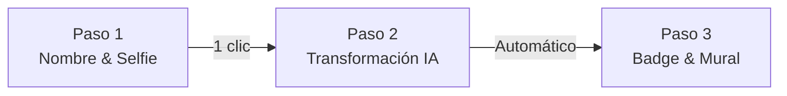

# UI/UX Design System & Experience Blueprint — Cancun DashBooth

## 1. Filosofía de Diseño y Visión General
- **Concepto Visual:** *Flutter Caribbean Modernism* — Una estética fresca, profesional y vibrante que combina la identidad de marca oficial de Flutter (azules limpios, líneas geométricas, mascota Dash) con el ambiente tropical y festivo de Cancún (aguas turquesas, iluminación cálida, degradados oceánicos).
- **Enfoque de Experiencia (UX):** Flujo de **Fricción Cero** (Zero-Friction). El asistente debe ser capaz de generar y compartir su credencial oficial en menos de 30 segundos, sin registros obligatorios ni formularios complejos.
- **Plataforma Objetivo:** Web responsiva (optimizado tanto para smartphones en mano como para monitores de escritorio y pantallas de proyección en la sala de conferencias).

---

## 2. Tokens de Diseño & Paleta de Colores

### A. Paleta Principal (Flutter & Caribbean Vibes)

```dart
class AppColors {
  // Brand Flutter Colors
  static const Color flutterBlue = Color(0xFF02569B);      // Azul primario de marca
  static const Color flutterSkyBlue = Color(0xFF04ACF6);   // Azul brillante / botones de acción
  static const Color dashCyan = Color(0xFF00E5FF);         // Cian eléctrico / acentos y visores

  // Caribbean Accent Colors
  static const Color caribbeanTeal = Color(0xFF00B4D8);    // Turquesa caribeño
  static const Color sunshineAmber = Color(0xFFFFB703);    // Dorado sol / etiquetas VIP "Flutter Pioneer"
  static const Color coralAccent = Color(0xFFFF70A6);      // Coral para toques festivos y micro-interacciones

  // Dark Modern Surface Palette (Tema Principal)
  static const Color bgDark = Color(0xFF0F172A);           // Azul pizarra profundo de fondo
  static const Color surfaceDark = Color(0xFF1E293B);      // Fondo de tarjetas y paneles
  static const Color surfaceCard = Color(0xFF273549);      // Elevación secundaria
  static const Color borderSubtle = Color(0x3300E5FF);     // Bordes brillantes translúcidos

  // Neutrales y Texto
  static const Color textPrimary = Color(0xFFF8FAFC);      // Blanco puro de alto contraste
  static const Color textSecondary = Color(0xFF94A3B8);    // Gris azulado para subtítulos
  static const Color textMuted = Color(0xFF64748B);        // Texto de ayuda y placeholders
}
```

### B. Gradientes de Marca

```dart
class AppGradients {
  // Gradiente insignia para botones de acción primarios
  static const LinearGradient flutterPrimary = LinearGradient(
    colors: [AppColors.flutterBlue, AppColors.flutterSkyBlue],
    begin: Alignment.topLeft,
    end: Alignment.bottomRight,
  );

  // Gradiente caribeño para acentos y marcos de fotos
  static const LinearGradient carribeanDash = LinearGradient(
    colors: [AppColors.flutterSkyBlue, AppColors.dashCyan],
    begin: Alignment.topCenter,
    end: Alignment.bottomCenter,
  );

  // Gradiente de fondo con brillo ambiental
  static const RadialGradient ambientGlow = RadialGradient(
    center: Alignment(0.0, -0.6),
    radius: 1.2,
    colors: [Color(0x3302569B), Colors.transparent],
  );
}
```

---

## 3. Tipografía & Jerarquía de Texto

La tipografía transmite claridad técnica y accesibilidad con `GoogleFonts.poppins`:

* **Display Title (H1):** 32px / Bold / `textPrimary` — Título principal de bienvenida y celebraciones.
* **Heading (H2):** 24px / SemiBold / `textPrimary` — Nombre del asistente en la credencial y cabeceras de sección.
* **Subheading (H3):** 18px / Medium / `flutterSkyBlue` — Indicadores de paso y subtítulos de estado.
* **Body Regular:** 14px / Regular / `textSecondary` — Instrucciones, descripciones y mensajes de carga.
* **Badge Role Pill:** 12px / Bold / `sunshineAmber` — Etiqueta conmemorativa *"Flutter Pioneer"*.

---

## 4. Estilo Visual: Material 3 + Glassmorphism Sutil

* **Bordes Redondeados (Border Radius):**
  * Botones y campos de texto: `BorderRadius.circular(16)`
  * Tarjetas principales y visor de cámara: `BorderRadius.circular(24)`
  * Credencial Oficial (Badge): `BorderRadius.circular(28)`
* **Efecto Frosted Glass (Glassmorphism):**
  * Tarjetas de navegación y visores flotantes con fondo translúcido (`Color(0xCC1E293B)`), borde sutil de `0.8px` con `borderSubtle` y desenfoque `ImageFilter.blur(sigmaX: 10, sigmaY: 10)`.
* **Elevación y Sombras:**
  * Sombras suaves con tono azul ambiental: `BoxShadow(color: Color(0x2602569B), blurRadius: 20, offset: Offset(0, 8))`.

---

## 5. Arquitectura del Flujo de Usuario (Zero-Friction UX)

El flujo está estructurado en 3 pasos lineales e intuitivos sin recargar la página:



### Paso 1: Registro Express y Captura de Foto
* **Formulario Ágil (Nombre y Correo):**
  * Campo de Nombre con ícono de credencial y validación en tiempo real (mínimo 2 caracteres).
  * Campo de Correo Electrónico para vincular el badge del asistente y evitar duplicados o para envío digital.
* **Visor de Cámara / Selector Multimedia:**
  * Marco vertical (aspect ratio 4:5) que simula la proporción de la credencial final.
  * Líneas guía de centrado sutiles en color `dashCyan`.
  * Botón flotante de captura: *"Tomar Selfie"* con opción secundaria *"Subir de la Galería"*.
  * Previsualización instantánea con botón de *"Volver a tomar foto"* si el usuario desea repetir la toma.

### Paso 2: Pantalla de Carga y Feedback Divertido
* Mientras `gemini-3.1-flash-image` transforma multimodalmente la selfie y genera la ilustración junto a Dash:
  * Ilustración destacada de bienvenida de Dash en la playa ([`images/dash_playa.png`](file:///Users/jggomez/Documents/jggomez/code/workshop-flutter-ia/images/dash_playa.png)) en la cabecera.
  * Barra de progreso indeterminada con gradiente `AppGradients.carribeanDash`.
  * Carrusel de mensajes dinámicos cada 3 segundos:
    1. *"Dash está preparando las palmeras bajo el sol de Cancún..."*
    2. *"Gemini 3.1 Flash Image está pintando tu retrato tropical..."*
    3. *"Generando a Dash y tu credencial oficial de FlutterConf LATAM..."*
  * Botones de acción deshabilitados para evitar duplicidad de solicitudes.

### Paso 3: Credencial Lista, Píldora IA Vibe, Descarga HD y Mural
* **La Credencial Oficial (`OfficialBadgeCard`):**
  * Marco superior con el logotipo oficial del evento ([`images/logo.png`](file:///Users/jggomez/Documents/jggomez/code/workshop-flutter-ia/images/logo.png)) y encabezado conmemorativo.
  * Retrato del usuario generado directamente por IA (`gemini-3.1-flash-image`) con Dash, palmeras y estética caribeña de alta calidad.
  * Nombre del asistente en tipografía de alto impacto (`Poppins` SemiBold).
  * Rol conmemorativo en dorado: `[★ Flutter Pioneer]`.
  * **Píldora Luminosa `IA Vibe`:** Etiqueta brillante con gradiente turquesa/azul, icono `Icons.auto_awesome` en amarillo ámbar, y título corto otorgado por Gemini (3 a 5 palabras, ej: *"Dash Surfista 100%"*, *"Capitán Caribe 100%"*), con ajuste multilínea automático (`maxLines: 2`, sin truncamiento).
  * Elementos tecnológicos de credencial: Chip NFC PASS dorado y líneas de código de barras.
  * Pie de tarjeta moderno y limpio con el hashtag oficial centrado: `#flutterconflatam26`.
* **Botones de Acción Primaria y Gestión de Ciclo de Vida:**
  * Botón 1 (Primario destacado): **"Descargar Credencial HD (PNG)"** (descarga inmediata de PNG con `pixelRatio: 2.0` sin demoras).
  * **Estado Antes de Publicar (`isPublished == false`):**
    * Botón de Publicación: **"Publicar en Mural de Recuerdos"** (con feedback amigable durante la publicación: *"Compartiendo en el Mural..."*).
    * Botón de Reinicio: `OutlinedButton.icon` con bordes redondeados: *"Limpiar y reiniciar formulario"*.
  * **Estado Tras Publicar (`isPublished == true`):**
    * **Protección Anti-Gasto de Cuota IA:** Se bloquean y atenúan (`IgnorePointer` y `Opacity(0.65)`) los inputs de nombre/email, el visor de cámara/subida y el botón de IA para impedir transformaciones accidentales o desperdicio de cuota de API en credenciales ya terminadas.
    * **Tarjeta Celebratoria:** Banner verde esmeralda *"¡Credencial en el Mural! 🎉 - Tu credencial ya brilla en el mural en vivo del evento."*
    * **Hero Action Button:** Botón brillante con gradiente ámbar caribeño: **"Crear Otra Credencial ✨"**. Al hacer clic, reinicia limpiamente el formulario, restablece todos los estados y desbloquea los controles para el siguiente asistente.

---

## 6. Mural Comunitario / Álbum de Fotos Desordenadas (Community Wall)

* **Concepto Visual:** *Álbum de Fotos Desordenadas de Conferencia* — En lugar de una cuadrícula monótona y rígida, el mural emula una mesa o muro de corcho donde los asistentes han dejado sus fotos como recuerdos de viaje:
  * **Inclinación Orgánica:** Cada foto cuenta con una sutil rotación angular calculada (-2.0° a +2.0° según índice o hash) para transmitir naturalidad y dinamismo.
  * **Estilo Polaroid Moderno:** Marco con textura clara, bordes redondeados y sombras difusas profundas (`BoxShadow(color: Colors.black45, blurRadius: 16)`).
  * **Micro-interacción Hover:** Al posar el cursor o pulsar sobre una foto, esta se endereza suavemente a 0° de rotación, se eleva en el eje Z y resalta su resplandor cian.
* **Sincronización en Tiempo Real:** Las fotos nuevas aparecen con una suave animación de entrada (`FadeTransition` + `ScaleTransition`) impulsadas por el `StreamProvider` de Firestore conectado a la colección `UserCards`.
* **Interacción Modal (`BadgeDetailModal`):**
  * Al tocar cualquier foto en el mural se abre `BadgeDetailModal` renderizando la credencial oficial en alta resolución (`OfficialBadgeCard`).
  * Incluye botones de acción directos:
    * **"Descargar Credencial HD (PNG)":** Guarda la credencial con nitidez retina en descargas.
    * **"Compartir en Instagram 📸":** Descarga el archivo, copia el caption con `#flutterconflatam26` al portapapeles y abre Instagram.
    * **"Cerrar":** Descartar modal.
* **Sorteo Gran Premio F1 (`F1RouletteDialog`):**
  * Botón deportivo destacado en la cabecera *"🏎️ Ruleta F1 Premios"*.
  * Al abrirse, inicia automáticamente un giro electrizante de **10.0 segundos** con 5 luces rojas de salida, velocímetro digital (hasta 345 km/h), telemetría en tiempo real y cuenta regresiva.
  * Desaceleración dramática en la recta final y revelación del Podio F1 con los 3 ganadores (P1 Oro 🏆, P2 Plata 🥈, P3 Bronce 🥉).
* **Pestañas de Navegación Superiores:**
  * Pestaña 1: **"Crear mi Badge"** (Estudio de captura, IA, personalización, descarga HD y compartir en Instagram).
  * Pestaña 2: **"Mural en Vivo"** (Álbum de fotos desordenadas comunitario en tiempo real y Ruleta F1).

---

## 7. Responsividad y Breakpoints Web

| Dispositivo | Rango de Ancho | Adaptación de la UI |
| :--- | :--- | :--- |
| **Móvil (Smartphones)** | `< 600px` | Columna única centrada, visor de cámara a ancho completo con márgenes de 16px, collage en 2 columnas. |
| **Tablet** | `600px - 1024px` | Ancho máximo de formulario contenido a 540px, collage en 3-4 columnas. |
| **Desktop & Proyector** | `> 1024px` | Layout dividido: a la izquierda controles y visor; a la derecha previsualización en vivo. Collage en 4-6 columnas fluido. |

---

## 8. Accesibilidad (a11y) y Rendimiento Web
- **Contraste WCAG AA:** Todos los textos principales mantienen un ratio de contraste superior a 4.5:1 sobre los fondos oscuros.
- **Áreas Táctiles Mínimas:** Botones con altura mínima de `48px` para evitar clics erróneos en navegadores móviles.
- **Animaciones Ligeras:** Exclusivo uso de propiedades aceleradas por hardware (`Transform`, `Opacity`) para garantizar 60 fps estables en WebGL y CanvasKit.
