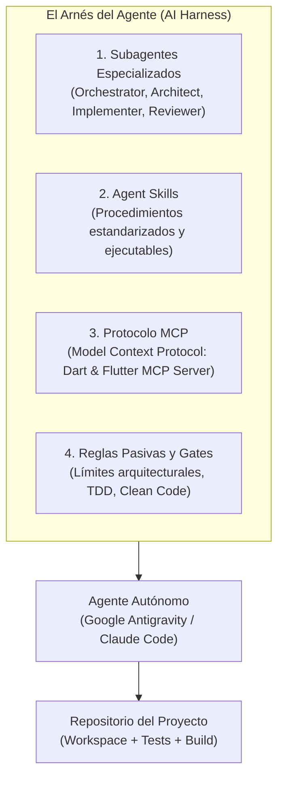

# Módulo 1: Configuración del Harness, Skills y Plugin `senior-dev-flutter`

> **Ruta:** `lab/01-harness-and-skills.md`  
> **Objetivo del Módulo:** Entender el concepto de **AI Harness Engineering**, aprovisionar las habilidades modulares (**Agent Skills**) requeridas, instalar el plugin especializado **`senior-dev-flutter`** y dejar listo el entorno de agentes para ejecutar bucles autónomos de desarrollo.

---

## 1. ¿Qué es AI Harness Engineering?

Tradicionalmente, programar con IA consistía en pegar fragmentos de código en una ventana de chat (*chat-based coding*). Este enfoque genera alucinaciones, código desarticulado, violaciones de estándares y pérdida constante de contexto.

El enfoque moderno de **AI Harness Engineering (Ingeniería de Arnés para IA)** transforma a los Modelos de Lenguaje en ingenieros de software integrados a tu proyecto mediante 4 pilares fundamentales:



1. **Subagentes Especializados:** En lugar de un único modelo que intenta hacer todo a la vez, se orquestan roles especializados con responsabilidades y políticas de ejecución delimitadas.
2. **Agent Skills (Estándar Abierto [agentskills.io](https://agentskills.io)):** Paquetes modulares que enseñan al agente *cómo* resolver tareas concretas (crear layouts adaptativos, ejecutar pruebas de widgets, serializar JSON, etc.) mediante instrucciones estructuradas en `SKILL.md`.
3. **Servidores MCP (Model Context Protocol):** Conexión nativa con herramientas del entorno en tiempo real (análisis estático de Dart, diagnóstico de tipos, inspección de dependencias, Firebase).
4. **Reglas Pasivas y Quality Gates:** Restricciones que el agente consulta de forma pasiva en cada paso (prohibición de `dart:io`, obligatoriedad de pruebas antes de confirmar cambios, política Zero-Auth).

---

## 2. Aprovisionamiento Automatizado con `skills.sh`

Para simplificar la configuración del harness en cualquier máquina, este proyecto incluye el script ejecutable [`skills.sh`](../skills.sh).

### ¿Qué hace `skills.sh`?
1. **Verifica prerrequisitos de sistema:** Valida que `flutter`, `dart` y `npx` estén presentes en el `PATH`.
2. **Instala Agent Skills oficiales:**
   * **`flutter/agent-plugins`**: Arquitectura por capas, layouts responsivos, pruebas de widgets, previsualización interactiva y peticiones HTTP.
   * **`dart-lang/skills`**: Pruebas unitarias con `package:test`, análisis estático con `dart analyze`, creación de utilidades CLI y ejemplos en documentación.
   * **`firebase/agent-skills`**: Uso de Firebase AI Logic, Cloud Firestore, Firebase Storage y Firebase Hosting.
3. **Instala Skills de Ingeniería Avanzada de [@jggomez](https://github.com/jggomez/expert-ai-developer-skills):**
   * **`test-driven-development`**: Ciclos estrictos de Red-Green-Refactor.
   * **`refactoring-code-expert`**: Patrones de diseño y principios SOLID.
   * **`code-smells-expert`**: Detección de acoplamiento, métodos largos y antipatrones.
4. **Instala y enlaza el Plugin `senior-dev-flutter`**: Garantiza la presencia local del plugin en `.agents/plugins/senior-dev-flutter`.

### Ejecución del Script
Ejecuta el siguiente comando en la terminal desde la raíz del proyecto:

```bash
chmod +x skills.sh
./skills.sh
```

Al completarse, verás el reporte de instalación y la actualización del archivo [`skills-lock.json`](../skills-lock.json), el cual actúa como el manifiesto versionado de todas las habilidades activas en el repositorio.

---

## 3. Instalación del Plugin `senior-dev-flutter`

El plugin **`senior-dev-flutter`** es el corazón operativo del harness. Proviene del repositorio central [jggomez/expert-ai-developer-skills](https://github.com/jggomez/expert-ai-developer-skills) y añade la capa senior de toma de decisiones, arquitectura y revisión por encima de las skills procedimentales.

### A. Instalación en Google Antigravity (AGY)
Si estás utilizando **Google Antigravity CLI**, instala el plugin directamente desde la ruta local con el comando `agy`:

```bash
# Instalar el plugin desde la carpeta local del proyecto
agy plugin install .agents/plugins/senior-dev-flutter

# Confirmar que quedó activo en tu entorno
agy plugin list
```

Deberás ver en la lista:
```text
✔ senior-dev-flutter (v1.0.0) — Enabled
```

### B. Instalación en Claude Code
Si utilizas **Claude Code**, agrégalo mediante el comando de marketplace:

```bash
# 1. Agregar el repositorio al catálogo de plugins
/plugin marketplace add jggomez/expert-ai-developer-skills

# 2. Instalar el plugin especializado de Flutter
/plugin install senior-dev-flutter
```

---

## 4. El Panel de 5 Subagentes de `senior-dev-flutter`

Una vez instalado el plugin, tu entorno cuenta con 5 subagentes especializados listos para ser invocados por el orquestador principal:

| Subagente | Rol en el Proyecto | Política de Ejecución | Responsabilidades Clave |
| :--- | :--- | :--- | :--- |
| **`flutter-feature-orchestrator`** | Orquestador Principal | `off` / `auto` | Evalúa solicitudes, dimensiona tareas en el marco de 9 etapas, redacta planes (`PLAN.md` / ADRs) y delega trabajo a los especialistas. |
| **`flutter-architect`** | Arquitecto de Software | `auto` | Define la estrategia de manejo de estado (Riverpod en nuestro caso), traza límites modulares limpios y registra Decisiones Arquitecturales (ADR). |
| **`flutter-implementer`** | Desarrollador TDD | `auto` | Escribe código de negocio, modelos, widgets y pruebas automatizadas siguiendo estrictamente ciclos Red-Green-Refactor. |
| **`flutter-reviewer`** | Revisor de Código Senior | `auto` | Audita accesibilidad, fugas de memoria, alcances de reconstrucción (`rebuild scope`), uso de `const`, y valida el pase limpio de `dart analyze`. |
| **`flutter-release-engineer`** | Ingeniero de Release | `auto` | Gestiona flavors, variables de compilación (`--dart-define-from-file`), matriz de compilación web y empaquetado para Firebase Hosting. |

---

## 5. Servidor MCP Oficial de Dart & Flutter

El plugin declara la conexión con el servidor **Dart & Flutter MCP Server**. Dado que el SDK oficial de Dart ya incluye el MCP server integrado a partir de Dart 3.7+, no requieres instalar binarios adicionales:

```bash
# Comprobar que el comando esté disponible
dart mcp-server --help
```

El servidor MCP expone herramientas automáticas que el agente invoca cuando necesita:
* Diagnosticar advertencias y sugerencias del compilador (`analyze_files`).
* Resolver definiciones y referencias de símbolos en el árbol de dependencias (`lsp`).
* Inspeccionar paquetes de `pub.dev` (`pub_dev_search`).
* Ejecutar hot reloads o comandos de Flutter Driver durante pruebas de integración.

---

## 6. Reglas Pasivas del Repositorio (`.agents/rules/`)

El arnés se completa con las reglas de gobierno ubicadas en la carpeta `.agents/rules/`. Estas reglas se cargan automáticamente en el contexto del agente:

* **`flutter-rules.md`**: Define el ciclo de desarrollo en 9 etapas (`/spec` ➔ `/plan` ➔ `/build` ➔ `/test` ➔ `/constraints` ➔ `/review` ➔ `/perf` ➔ `/code-simplify` ➔ `/ship`) y la regla de oro: *Cero dependencias de `dart:io` en código Flutter Web*.
* **`tdd-best-practices.md`**: Obliga a crear o actualizar pruebas antes de dar por finalizada cualquier funcionalidad.
* **`testing-after-changes.md`**: Exige ejecutar la suite de pruebas tras cada modificación de código.
* **`clean-code-and-principles.md`**: Enfatiza principios SOLID, legibilidad y funciones con una sola responsabilidad.

---

## 7. Ejercicio Práctico del Módulo 1

Verifica que tu harness esté 100% operativo ejecutando los siguientes pasos de comprobación:

1. Ejecuta `./skills.sh` y confirma que la salida concluya en verde.
2. Verifica la presencia de las skills en el directorio local:
   ```bash
   ls -la .agents/skills/
   ```
3. Ejecuta una prueba rápida del analizador con el gate estricto:
   ```bash
   dart analyze --fatal-infos
   ```
   *Resultado esperado:* `No issues found!`

---

### Siguiente Paso:
Con el arnés, las skills y el plugin listos, avanza al **[Módulo 2: Especificación y Documentación Viva (Spec-Driven Development)](02-spec-and-doc-driven-dev.md)** para aprender a redactar el mapa que guiará a la IA.
