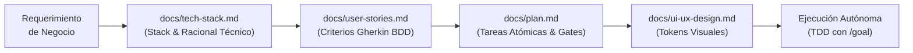

# Módulo 2: Spec-First & Documentación Viva (Spec-Driven Development)

> **Ruta:** `lab/02-spec-and-doc-driven-dev.md`  
> **Objetivo del Módulo:** Comprender la filosofía de **Spec-First** y aprender a diseñar la suite de documentación viva en la carpeta `docs/` (`tech-stack.md`, `user-stories.md`, `plan.md`, `ui-ux-design.md`) para proporcionar al agente un contexto determinista, inmutable y libre de ambigüedades.

---

## 1. La Regla de Oro: "Spec Before Code"

Uno de los errores más comunes al utilizar asistentes de inteligencia artificial es solicitar de inmediato la generación de código:  
*“Escribe una app en Flutter con cámara e inteligencia artificial que guarde fotos en Firebase”*.

Este tipo de peticiones vagas provoca que los Modelos de Lenguaje:
* Asuman librerías incompatibles con Flutter Web (por ejemplo, importando `dart:io` para crear archivos temporales).
* Inventen esquemas de datos redundantes o datos ficticios no deseados (como correos `fake@test.com`).
* Omitan el manejo de estados de carga, timeouts de red y fallos de autorización (como el error 401 de App Check).
* Pierdan la visión global de la aplicación entre una sesión de trabajo y la siguiente.

Para erradicar estos problemas, adoptamos la metodología **Spec-First (Especificación antes de Código)**: definimos con precisión quirúrgica el stack tecnológico, los requerimientos funcionales en formato Gherkin BDD, el plan maestro de ejecución y las directrices de diseño visual **antes de escribir una sola línea de Dart**.



---

## 2. Los 4 Documentos Clave de la Suite `docs/`

En Cancun DashBooth, creamos y mantenemos activamente cuatro archivos que componen la memoria de trabajo permanente del sistema:

### 2.1. `docs/tech-stack.md` — El Manifiesto Arquitectónico
Este documento define las tecnologías elegidas, el porqué de cada decisión y las reglas no negociables de la arquitectura.

* **Secciones críticas:**
  1. **Visión General:** Plataforma objetivo (Flutter Web con soporte CanvasKit/Wasm) y patrón arquitectónico (Clean Architecture + Riverpod).
  2. **Catálogo de Dependencias:** Lista exhaustiva de paquetes en `pubspec.yaml` con justificación técnica (`firebase_ai`, `cloud_firestore`, `firebase_storage`, `flutter_riverpod`, `universal_html`, etc.).
  3. **Estrategia Dual-Channel para IA:** Explicación del flujo principal con `FirebaseAI.googleAI()`, el fallback transparente a Google AI Developer REST API ante errores 401 de App Check en Web local, y el catálogo determinista offline.
  4. **Estrategia Zero-Auth en Firestore y Storage:** Justificación de por qué en una conferencia se evita forzar pantallas de login, separando el almacenamiento masivo binario en Firebase Storage (`user_cards/{cardId}.png`) y los metadatos livianos en Cloud Firestore (`UserCards`).
  5. **Invariantes Arquitecturales (Reglas No Negociables):**
     * *Regla 1:* Prohibición absoluta de `dart:io` (manipulación en memoria mediante `Uint8List`).
     * *Regla 2:* Separación estricta de capas (`domain/`, `data/`, `presentation/`).
     * *Regla 3:* Cero lógica de negocio dentro del árbol de Widgets.
     * *Regla 4:* Timeout de 15s con fallback en llamadas a modelos generativos.
     * *Regla 5:* Estrategia Zero-Auth sin login para alta velocidad en eventos.
     * *Regla 6:* Política de Cero Datos Ficticios (**Zero-Fake-Data Policy**).
     * *Regla 7:* Protección de cuota de IA con bloqueo preventivo post-publicación.

---

### 2.2. `docs/user-stories.md` — Historias de Usuario con Criterios Gherkin
Describe el comportamiento esperado del sistema desde la perspectiva del usuario final, expresado mediante la sintaxis **Given-When-Then (Gherkin BDD)**.

Cada historia de usuario aborda un escenario específico y delimita sus invariantes de implementación:
* **US-01: Registro de Asistente y Captura de Selfie en Web:**
  * Nombre obligatorio, correo opcional (sin inyectar datos sintéticos si se deja en blanco).
  * Captura de cámara como bytes en memoria (`Uint8List`).
  * Bloqueo post-publicación y acción hero *"Crear Otra Credencial ✨"*.
* **US-02: Generación Multimodal Caribeña con Firebase AI (`gemini-3.1-flash-image`):**
  * Envío de selfie y prompt en inglés estructurado con *Character Anchoring* estricto de Dash (muñeco de peluche de ave azul con plumas de fieltro, explícitamente NO un pez o delfín).
  * Retorno simultáneo de bytes de imagen y frase corta caribeña de 3 a 5 palabras.
  * Interfaz con copy amigable y empático (cero logs técnicos de infraestructura).
* **US-03: Composición de la Card Oficial, Píldora IA Vibe y Descarga Web:**
  * Proporción 4:5 vertical, hashtag oficial `#flutterconflatam26`, chip dorado NFC PASS y píldora multilínea sin truncamiento.
  * Descarga nativa en navegador a través de `RepaintBoundary` (`pixelRatio: 2.0`) y Blob seguro.
* **US-04: Mural Comunitario y Álbum Desordenado en Tiempo Real:**
  * Almacenamiento en Firebase Storage y Cloud Firestore bajo política Zero-Fake-Data.
  * Banner de cabecera permanentemente horizontal (previniendo colapsos de diseño vertical en CanvasKit).
  * Collage en vivo con inclinaciones sutiles aleatorias (-2° a +2°).
* **US-05: Sorteo de Premios con Ruleta F1 y Podio de Ganadores:**
  * Semáforo de salida con 5 luces rojas (`🔴🔴🔴🔴🔴`).
  * Giro emocionante de 10 segundos exactos a más de 330 km/h con desaceleración dramática.
  * Podio clásico de F1 (P1 Oro 🥇, P2 Plata 🥈, P3 Bronce 🥉) con filtrado de privacidad de correos (`_isRealUserEmail`).
* **US-06: Descarga HD y Compartir en Instagram:**
  * Modal interactivo de inspección con descarga en alta resolución y publicación directa en Instagram Stories con el hashtag oficial copiado al portapapeles.

---

### 2.3. `docs/plan.md` — El Plan Maestro de Tareas Atómicas & Gates
Descompone el proyecto en fases secuenciales y tareas atómicas verificables.

* **Estructura de Fases:**
  * *Fase 1:* Aprovisionamiento de Firebase, Scaffolding Web y Sistema de Diseño.
  * *Fase 2:* Capa de Dominio (Entidades, contratos abstractos y pruebas TDD).
  * *Fase 3:* Capa de Datos (Firebase AI, Firestore, Storage y mocks con `mocktail`).
  * *Fase 4:* Capa de Estado Reactivo con Riverpod (Notifiers y StreamProviders).
  * *Fase 5:* Widgets UI y Pantallas Principales (Glassmorphism, Viewfinder y BadgeCard).
  * *Fase 6:* Verificación Sensorial y Compilación Web.
  * *Fases 7 a 13:* Refinamiento iterativo (Branding, Resiliencia Dual-Channel, Ruleta F1, Bloqueo de Cuota, Responsividad CanvasKit y Calidad Final).
* **Condición de Parada (Gate):**
  * `dart analyze --fatal-infos` con **0 issues**.
  * Suite completa de pruebas automatizadas pasando al **100%**.
  * Cero dependencias de `dart:io`.

---

### 2.4. `docs/ui-ux-design.md` — Sistema de Diseño y Tokens Visuales
Establece los estándares estéticos y los componentes visuales:
* **Paleta de Colores Caribeña:** Flutter Blue (`#02569B`), Flutter Sky Blue (`#0175C2`), Dash Cyan (`#40D3F2`), Caribbean Teal (`#00B4D8`), Sunshine Amber (`#FFB703`), Background Dark (`#0A192F`).
* **Efectos Glassmorphism:** Contenedores con `BackdropFilter` (blur 12px), bordes cian translúcidos y esquinas redondeadas de 20px.
* **Tipografía:** Jerarquía visual con `GoogleFonts.poppins` en pesos Regular, Medium y SemiBold.

---

## 3. ¿Por qué la Documentación Viva Evita la Pérdida de Contexto?

En proyectos largos o al retomar una sesión tras horas o días, el agente no recuerda el historial completo de interacciones pasadas. Sin embargo, al iniciar cualquier tarea:

1. El agente inspecciona los archivos en `docs/`.
2. Lee las reglas arquitectónicas y comprende los contratos establecidos.
3. Conoce exactamente qué variables o funciones existen (por ejemplo, sabe que `_isRealUserEmail` protege el podio de F1 y que el banner de `CommunityWallScreen` debe ser horizontal).
4. Aplica cambios **quirúrgicos** sin romper código preexistente ni revertir soluciones previamente acordadas.

---

## 4. Ejercicio Práctico del Módulo 2

Inspecciona los documentos de especificación creados en tu proyecto para familiarizarte con su estructura:

```bash
# Revisar el stack técnico y sus invariantes
head -n 60 docs/tech-stack.md

# Revisar las historias de usuario y criterios de aceptación
head -n 60 docs/user-stories.md

# Revisar el estado de avance en el plan maestro
head -n 60 docs/plan.md
```

---

### Siguiente Paso:
Con las especificaciones y reglas firmemente establecidas, avanza al **[Módulo 3: Demostración de Looping con `/goal` para Construir el MVP](03-looping-con-goal-mvp.md)** para aprender a activar la ejecución autónoma de la IA.
