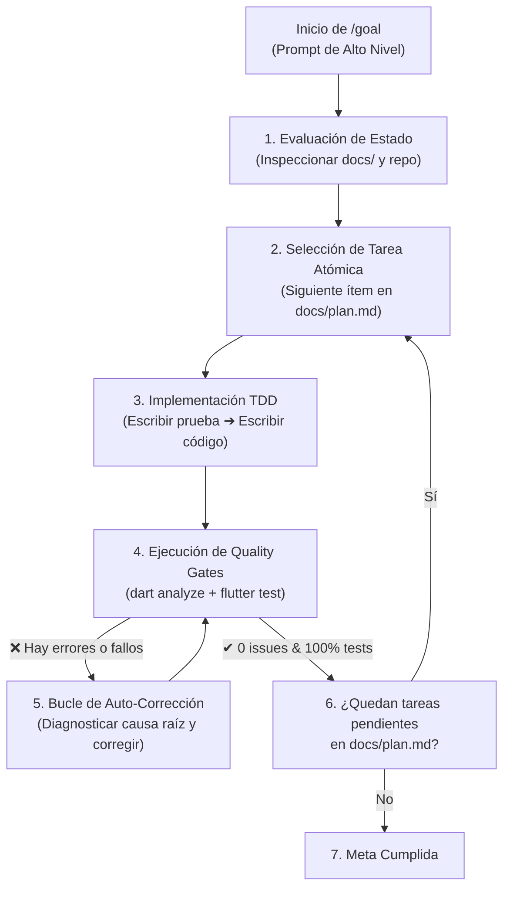

# Módulo 3: Demostración de Looping con `/goal` para Construir el MVP

> **Ruta:** `lab/03-looping-con-goal-mvp.md`  
> **Objetivo del Módulo:** Comprender la anatomía del comando de bucle autónomo **`/goal`**, entender cómo se orquesta la auto-corrección mediante ciclos de Test-Driven Development (TDD) y Quality Gates, y aprender a formular directivas de alto impacto para construir el Producto Mínimo Viable (MVP) sin requerir microgestión manual.

---

## 1. De la Microgestión al Bucle Autónomo (Looping)

En los flujos de desarrollo asistido por IA convencionales, el programador actúa como un operador manual que debe guiar cada paso:
1. *“Crea el modelo de datos”* ➔ Esperar respuesta.
2. *“Ahora crea el repositorio”* ➔ Esperar respuesta.
3. *“Falló la importación, corrígela”* ➔ Esperar respuesta.
4. *“Ahora escribe la UI”* ➔ Esperar respuesta.

Este paradigma es lento, propenso a fatiga y desaprovecha la capacidad de razonamiento profundo de los modelos avanzados.

El comando **`/goal`** introduce el paradigma de **Autonomous Looping (Bucle de Ejecución Autónoma)**: defines un objetivo de alto nivel respaldado por especificaciones y restricciones, y el agente entra en un ciclo auto-regulado hasta alcanzar la condición de parada verificable:



---

## 2. Anatomía del Ciclo de Auto-Corrección en un `/goal`

Durante un `/goal`, el agente no asume que su código funciona simplemente porque lo escribió; **está obligado a probarlo de forma empírica**.

El ciclo opera bajo 5 principios fundamentales:

1. **Lectura de Memoria y Restricciones:** El agente inicia leyendo [`docs/tech-stack.md`](../docs/tech-stack.md), [`docs/user-stories.md`](../docs/user-stories.md) y [`docs/plan.md`](../docs/plan.md). Así adquiere el contexto completo del proyecto.
2. **Ciclo Red-Green-Refactor (TDD):** Invoca la skill `test-driven-development` y `dart-add-unit-test`. Primero escribe la prueba unitaria o de widget que describe el comportamiento esperado (falla en rojo), luego implementa el código mínimo para hacerla pasar (verde), y finalmente refactoriza manteniendo el pase limpio.
3. **Análisis Estático Automático (`dart analyze --fatal-infos`):** El analizador de Dart actúa como el primer filtro estricto. Si existe un warning, variable sin tipar o import innecesario, el agente lo resuelve antes de continuar.
4. **Ejecución de Pruebas en Background (`flutter test`):** El arnés dispara la suite de pruebas mediante comandos en segundo plano. Si una prueba falla, el sistema despierta al agente con el log de error exacto para que aplique la corrección.
5. **Condición de Parada Formal:** El agente solo finaliza cuando todas las tareas del plan están marcadas y los gates de calidad están completamente aprobados.

---

## 3. El Prompt Maestro de `/goal` para el MVP de Cancun DashBooth

A continuación se presenta la directiva real utilizada para construir el MVP completo de Cancun DashBooth de forma autónoma:

```text
/goal Construye de punta a punta el MVP de producción de Cancun DashBooth para FlutterConf LATAM Cancún 2026.

Instrucciones de Ejecución:
1. Lee y sigue estrictamente las especificaciones en:
   - docs/tech-stack.md (dependencias, estrategia Zero-Auth, arquitectura dual-channel, invariantes).
   - docs/user-stories.md (historias de usuario US-01 a US-06 con criterios Gherkin).
   - docs/plan.md (sigue la secuencia de fases 1 a 6 y marca tareas completadas).
   - docs/ui-ux-design.md (tokens de diseño caribeño, Poppins y glassmorphism).

2. Implementa las capas en estricto orden de Clean Architecture con TDD:
   - Capa Domain: Entidades inmutables (BadgeDraft, AiBadgeResult, UserCard) y contratos abstractos.
   - Capa Data: Servicio de cámara web-safe, Firebase Storage, Cloud Firestore (UserCards) y Firebase AI Logic (gemini-3.1-flash-image) con fallback transparente a Google AI Developer REST API.
   - Capa Presentation: Notifiers y StreamProviders con Riverpod, pantalla de photobooth de 3 pasos, credencial oficial OfficialBadgeCard con #flutterconflatam26 y mural comunitario en tiempo real.

3. Quality Gates no negociables en cada fase:
   - dart analyze --fatal-infos con 0 issues.
   - flutter test con 100% de pruebas pasando.
   - Cero dependencias de dart:io (100% web-safe).

4. Al concluir, compila la versión de producción con flutter build web --release y confirma que todo esté listo.
```

---

## 4. Caso Real de Auto-Corrección: El Fallo 401 de App Check

Un ejemplo sobresaliente del poder del bucle autónomo durante la creación de Cancun DashBooth ocurrió durante la integración de Firebase AI en Web:

1. **El Problema:** Al probar la invocación oficial con `package:firebase_ai` en el navegador local (`http://localhost:8080`), la API de Firebase Vertex AI respondió con `401 Unauthorized` debido a que Firebase Vertex AI exige tokens de Firebase App Check en clientes web.
2. **Diagnóstico del Agente:** En lugar de detenerse y pedir ayuda al usuario, el agente consultó la regla de resiliencia en `docs/tech-stack.md` (Regla 4: Resiliencia ante Fallos de Red).
3. **Auto-Corrección Quirúrgica:**
   * El agente diseñó de inmediato la arquitectura **Dual-Channel**: si la llamada al SDK de Firebase AI arroja una excepción, el datasource ejecuta inmediatamente una petición HTTP POST a la REST API de Firebase Vertex AI (`https://firebasevertexai.googleapis.com/v1beta/projects/$projectId/models/gemini-3.1-flash-image:generateContent?key=$apiKey`).
   * Esta llamada comparte la misma clave pública de Firebase configurada en `firebase_options.dart`, interactúa directamente con el endpoint de Firebase Vertex AI y devuelve exactamente los mismos bytes de imagen y texto multimodal.
4. **Verificación:** El agente corrió los tests unitarios (`ai_badge_remote_datasource_test.dart`) y confirmó que el fallback operaba de forma transparente para el usuario final.

---

## 5. Ejercicio Práctico del Módulo 3

Aprende a formular y lanzar una meta autónoma acotada en tu entorno:

1. Supongamos que deseas agregar una nueva prueba o validar el estado general del proyecto.
2. Envía en tu terminal de Antigravity o Claude Code la siguiente directiva:
   ```text
   /goal Audita la suite completa de pruebas del proyecto, ejecuta flutter test y dart analyze --fatal-infos, y confirma que todos los gates de calidad de docs/plan.md se cumplan al 100%.
   ```
3. Observa cómo el agente toma el control, ejecuta las verificaciones en background y concluye reportando el resultado sin interrumpirte.

---

### Siguiente Paso:
Con la dinámica del bucle autónomo clara, sumérgete en los detalles de código en el **[Módulo 4: Paso a Paso de la Implementación Core (Clean Architecture + TDD)](04-core-implementation-paso-a-paso.md)**.
