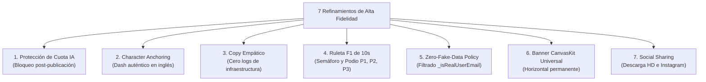

# Módulo 5: Refinamiento Iterativo y Lecciones del Pulido (Fine-Tuning Loop)

> **Ruta:** `lab/05-refinamiento-iterativo-y-maduracion.md`  
> **Objetivo del Módulo:** Comprender por qué la fase de refinamiento y pulido fino es el reto más complejo del desarrollo asistido por IA, analizar las 7 optimizaciones clave implementadas en Cancun DashBooth y aprender cómo la documentación viva actualizada garantiza que las iteraciones futuras sean precisas y sin regresiones.

---

## 1. El Desafío del Refinamiento Fino con IA

Construir el andamiaje inicial (scaffolding), las pantallas básicas y las operaciones CRUD con IA suele ser rápido y directo. Sin embargo, **el 80% del valor de un producto de software reside en el 20% final: el pulido fino**.

En esta etapa surgen los retos del mundo real:
* ¿Cómo evitamos que los usuarios agoten nuestra cuota de IA por clics repetidos?
* ¿Por qué el modelo de imagen dibuja a Dash como un delfín en lugar de un ave de peluche?
* ¿Por qué el layout se quiebra verticalmente en pantallas móviles en CanvasKit?
* ¿Por qué aparecen correos sintéticos en el sorteo de premios si el usuario no los ingresó?

Cuando intentas resolver estos detalles mediante prompts improvisados, corres el riesgo de romper código que ya funcionaba o de caer en bucles de prueba y error.

### La Clave: Actualizar la Documentación tras cada Refinamiento
El secreto de la maestría en AI Engineering consiste en **cerrar el ciclo de retroalimentación**: cada vez que se diagnostica y resuelve un detalle fino, **se actualiza de inmediato `docs/tech-stack.md`, `docs/user-stories.md` y `docs/plan.md`**.

De esta manera, en la siguiente sesión de trabajo o en futuros sprints, el agente no vuelve a cometer el mismo error: lee la regla documentada y la aplica de forma determinista.

---

## 2. Los 7 Grandes Refinamientos de Cancun DashBooth

A continuación se detallan las lecciones y soluciones arquitectónicas implementadas para llevar Cancun DashBooth al estándar de producción:



---

### Refinamiento 1: Protección de Cuota de IA & Bloqueo Post-Publicación
* **El Problema:** Tras publicar su credencial en el mural, el usuario podía volver a presionar *"Transformar con Dash IA"* o *"Tomar Foto"*, sobreescribiendo el estado y consumiendo innecesariamente cuota y dinero de la API de Gemini.
* **La Solución:**
  1. Al completarse la publicación (`isPublished == true`), el formulario, el visor de cámara y el botón de IA se atenúan (`Opacity(0.65)`) y se bloquean mediante `IgnorePointer`.
  2. El botón de IA muestra el estado inactivo *"Credencial Publicada"*.
  3. Se despliega una tarjeta celebratoria con el botón hero primario: **"Crear Otra Credencial ✨"**.
  4. Al pulsar este botón, la función `_handleReset()` resetea los controladores, limpia el borrador en Riverpod y reactiva el formulario de manera limpia y controlada para el siguiente asistente.

---

### Refinamiento 2: Character Anchoring y Prompt de Difusión en Inglés para Dash
* **El Problema:** Inicialmente, el modelo generativo dibujaba a Dash como un delfín o criatura marina azul, debido a la asociación semántica de la palabra "Cancún" y "mar Caribe".
* **La Solución:**
  1. Se reestructuró el prompt a **inglés**, optimizándolo según los estándares de ingeniería de prompts para modelos de difusión de Google (*Subject, Character Anchoring, Setting, Style, Lighting, Mood*).
  2. Se aplicó una técnica estricta de **Character Anchoring** en [`AiBadgeRemoteDataSource`](../lib/data/datasources/ai_badge_remote_datasource.dart):
     > *"CRITICAL MASCOT DETAILS: Dash is a cute, round, chubby, fluffy blue plush bird toy (NOT a dolphin, NOT a fish, NOT an aquatic animal). Dash has a plump round body covered in soft cyan and royal-blue felt feathers with a cream-white belly patch, large friendly round cartoon eyes, a tiny short triangular orange beak, two small rounded blue bird wings, and two tiny orange bird feet standing on the sand."*
  3. Resultado: Dash se renderiza de forma consistente como la mascota oficial de Flutter junto al asistente.

---

### Refinamiento 3: Eliminación de Lenguaje Técnico de Infraestructura
* **El Problema:** La interfaz mostraba mensajes técnicos en los botones y snackbars: *"Subiendo a Firestore y Storage..."*. Un asistente en una conferencia no necesita conocer la arquitectura de backend ni los servicios cloud que se están invocando.
* **La Solución:**
  Se sustituyeron todos los textos por copy cálido, empático y festivo:
  * De *"Subiendo a Firestore y Storage..."* ➔ **"Compartiendo en el Mural..."**.
  * De *"Documento creado en UserCards"* ➔ **"¡Tu credencial ha sido publicada en el Mural en Vivo! 🎉"**.

---

### Refinamiento 4: Sorteo de Premios con Ruleta F1 de 10 Segundos y Podio
* **El Problema:** Los organizadores necesitaban una dinámica emocionante para rifar premios entre los asistentes que habían publicado su foto.
* **La Solución:**
  Se creó el diálogo modal [`F1RouletteDialog`](../lib/presentation/widgets/f1_roulette_dialog.dart):
  * **Auto-Start:** Inicia de inmediato al abrirse el popup sin pasos innecesarios.
  * **Semáforo Reglamentario:** Secuencia de 5 luces rojas (`🔴🔴🔴🔴🔴`) durante los primeros 1.5 segundos.
  * **Lights Out & Away We Go!:** Giro vertiginoso a más de 330 km/h alternando participantes registrados.
  * **Desaceleración Dramática:** En los últimos 2.5 segundos desacelera progresivamente con cronómetro decreciente hasta alcanzar exactamente 10.0 segundos.
  * **Podio F1 Tridimensional:** Animación elástica que revela a los 3 ganadores en sus respectivos pedestales:
    * **P1 (Oro, 170px):** Trofeo 🏆, corona de laureles y título *"¡CAMPEÓN!"*.
    * **P2 (Plata, 120px):** Trofeo 🥈 y pedestal plateado.
    * **P3 (Bronce, 90px):** Trofeo 🥉 y pedestal cobrizo.

---

### Refinamiento 5: Política de Cero Datos Ficticios (Zero-Fake-Data Policy)
* **El Problema:** El formulario asignaba automáticamente `'pioneer@flutterconf.latam'` cuando el asistente dejaba el correo vacío. Este correo ficticio aparecía en la ruleta y en el podio, generando confusión entre los organizadores.
* **La Solución:**
  1. Si el usuario no ingresa correo, se guarda estrictamente como cadena vacía `""`.
  2. En [`F1RouletteDialog`](../lib/presentation/widgets/f1_roulette_dialog.dart), se implementó la función de guardia:
     ```dart
     bool _isRealUserEmail(String? email) {
       if (email == null) return false;
       final trimmed = email.trim().toLowerCase();
       if (trimmed.isEmpty) return false;
       if (trimmed.contains('pioneer@flutterconf.latam') ||
           trimmed.contains('asistente@flutterconf.latam') ||
           trimmed.contains('dash@flutterconf.latam')) {
         return false;
       }
       return true;
     }
     ```
  3. Si el correo no es auténtico, la línea se oculta con total elegancia en el podio, mostrando con orgullo el nombre y la foto del participante sin inventar identidades falsas.

---

### Refinamiento 6: Responsividad Universal del Mural en CanvasKit
* **El Problema:** En Flutter Web CanvasKit, anidar un botón con degradado dentro de una fila flexible que conmutaba a columna en anchos menores a 720px provocaba que los títulos se apilaran verticalmente de forma rota y estrecha (*"Álbum de Recuerdos" colapsado letra por letra*) y disparaba errores de shader (`MakeLinearGradient: null`).
* **La Solución:**
  1. En [`CommunityWallScreen`](../lib/presentation/screens/community_wall_screen.dart), el banner de cabecera se fijó de forma **permanentemente horizontal** mediante `Row(mainAxisAlignment: MainAxisAlignment.spaceBetween)`.
  2. Los títulos se envuelven en `Expanded` con `TextOverflow.ellipsis`.
  3. El botón CTA se adapta suavemente (`isCompact: isNarrow`), mostrando `🏎️ Ruleta F1` en móviles y `🏎️ Ruleta F1 Premios` en pantallas anchas.
  4. Se añadió un botón flotante persistente (`FloatingActionButton.extended`) con `heroTag: 'f1_roulette_fab'` anclado en la esquina inferior derecha para acceso inmediato durante el scroll.

---

### Refinamiento 7: Descarga HD y Compartir en Instagram
* **El Problema:** Los asistentes querían compartir de inmediato su badge en Instagram Stories sin tener que buscar la imagen en su carpeta de descargas.
* **La Solución:**
  Se implementó [`SocialShareService`](../lib/presentation/utils/social_share_service.dart):
  1. Aplana el `RepaintBoundary` a PNG nítido y dispara la descarga automática.
  2. Copia al portapapeles el texto oficial con el hashtag:  
     `¡Mi credencial oficial de FlutterConf LATAM Cancún 2026 con Dash! 🦜✨🌴 #flutterconflatam26`
  3. Invoca la API nativa de Web Share en navegadores compatibles.
  4. Despliega un diálogo de confirmación con botón directo *"Abrir Instagram 📸"*.

---

## 3. Conclusión del Refinamiento

Gracias a que cada uno de estos 7 refinamientos quedó rigurosamente asentado en la documentación (`docs/`), cualquier desarrollador o agente que trabaje en el proyecto en el futuro entenderá de inmediato el porqué de cada línea de código y no revertirá estas decisiones críticas.

---

### Siguiente Paso:
Finaliza tu aprendizaje con el **[Módulo 6: Quality Gates, Testing Sensorial y Despliegue](06-verificacion-calidad-y-despliegue.md)**.
