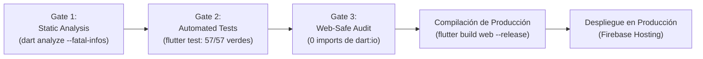

# Módulo 6: Quality Gates, Testing Sensorial y Despliegue en Producción

> **Ruta:** `lab/06-verificacion-calidad-y-despliegue.md`  
> **Objetivo del Módulo:** Conocer los **Quality Gates (Puertas de Calidad)** no negociables que garantizan la robustez del código, realizar la verificación sensorial en navegadores reales y aprender a compilar y desplegar la aplicación en **Firebase Hosting**.

---

## 1. Los 3 Quality Gates No Negociables

En la metodología de AI Harness Engineering, una funcionalidad no está terminada cuando el código se escribe; está terminada **únicamente cuando supera las tres puertas de calidad automáticas**:



---

### Gate 1: Análisis Estático Estricto (`dart analyze --fatal-infos`)
Garantiza que no existan advertencias, variables sin tipo explícito, imports sin uso ni violaciones de los linters oficiales de Flutter (`flutter_lints`).

Ejecuta en tu terminal:
```bash
dart analyze --fatal-infos
```

*Criterio de Aprobación:*
```text
Analyzing workshop-flutter-ia...
No issues found!
```

---

### Gate 2: Suite Automatizada de Pruebas (`flutter test`)
Cancun DashBooth cuenta con **57 pruebas automatizadas** distribuidas a lo largo de todas las capas de la Clean Architecture:

* **Capa Domain (14 tests):**
  * `test/domain/entities/`: Valida la inmutabilidad, campos requeridos y métodos `copyWith` de `BadgeDraft`, `AiBadgeResult` y `UserCard`.
  * `test/domain/usecases/`: Valida el lanzamiento de `ArgumentError` ante entradas inválidas y la orquestación correcta de `GenerateAiBadgeUseCase` y `PublishUserCardUseCase`.
* **Capa Data (10 tests):**
  * `test/data/models/`: Serialización y deserialización JSON y Firestore de `UserCardModel`.
  * `test/data/repositories/`: Mocks de Firebase con `mocktail` para verificar la subida a Storage y la persistencia en `UserCards`.
  * `test/data/datasources/`: Prueba de captura en memoria de `CameraServiceImpl`.
* **Capa Presentation (33 tests):**
  * `test/presentation/providers/`: Estados asíncronos (`AsyncData`, `AsyncLoading`, `AsyncError`) de `badgeDraftProvider`, `aiGenerationProvider`, `cardPublishProvider` y `communityWallProvider`.
  * `test/presentation/widgets/`: Verificación de renderizado de `OfficialBadgeCard`, `NameEmailForm`, `BadgeDetailModal` y `F1RouletteDialog` (giro automático de 10s y podio P1, P2, P3).
  * `test/presentation/screens/`: Flujo completo de 3 pasos en `PhotoboothScreen` y grid reactivo en `CommunityWallScreen`.

Ejecuta la suite completa:
```bash
flutter test
```

*Criterio de Aprobación:*
```text
00:16 +57: All tests passed!
```

---

### Gate 3: Auditoría de Seguridad Web (Web-Safe Memory Audit)
Dado que la aplicación corre en navegadores web, cualquier import accidental de `dart:io` (como `dart:io File` o `Platform`) provocaría un colapso en tiempo de ejecución en CanvasKit.

Ejecuta el siguiente comando para auditar que la carpeta `lib/` no contenga referencias a `dart:io`:

```bash
grep -rn "import 'dart:io'" lib/ || grep -rn 'import "dart:io"' lib/
```

*Criterio de Aprobación:* Salida vacía (cero coincidencias).

---

## 2. Compilación de Producción Web

Una vez aprobados los tres gates, se compila el bundle optimizado para navegadores utilizando el renderizador CanvasKit:

```bash
flutter build web --release
```

Este comando genera los artefactos de producción en el directorio `build/web/`:
* `main.dart.js`: Código Dart compilado y minificado a JavaScript de alto rendimiento.
* `canvaskit/`: Motor de renderizado WebGL/Skia para fluidez visual idéntica a nativo.
* `assets/`: Imágenes (`logo.png`, `dash_playa.png`), fuentes Google Fonts y recursos estáticos.
* `index.html`: Página de aterrizaje con meta tags y configuración de Service Worker.

---

## 3. Testing Sensorial en el Navegador

Para verificar visualmente la fluidez de las animaciones, los contrastes de diseño y la responsividad, levantamos un servidor HTTP local apuntando a la carpeta de compilación:

```bash
# Iniciar servidor web en el puerto 8080
python3 -m http.server 8080 -d build/web
```

Abre tu navegador en `http://localhost:8080` y realiza la siguiente comprobación sensorial:

1. **Prueba de Creación de Credencial:**
   * Ingresa tu nombre en el formulario.
   * Haz clic en *"Tomar Selfie"* o sube una fotografía.
   * Pulsa *"Transformar con Dash IA ✨"* y observa el loader con avatar de Dash.
   * Verifica la píldora brillante `✨ IA Vibe` y el hashtag oficial `#flutterconflatam26`.
   * Pulsa *"Descargar Credencial HD"* y confirma que el archivo PNG se descargue nítido sin pixelado.
   * Pulsa *"Compartir en Instagram 📸"* y comprueba el modal con el texto oficial copiado.
   * Pulsa *"Publicar en el Mural"* y confirma el mensaje *"¡Tu credencial ha sido publicada en el Mural en Vivo! 🎉"*.
   * Comprueba que los campos se bloqueen inmediatamente y que el botón hero *"Crear Otra Credencial ✨"* te permita reiniciar el formulario.
2. **Prueba del Mural Comunitario:**
   * Pasa a la pestaña *"Mural en Vivo"*.
   * Observa tu foto recién publicada en el álbum desordenado con marco polaroid.
   * Haz tap sobre la foto para abrir el modal de detalle.
3. **Prueba de la Ruleta F1:**
   * Pulsa el botón *"🏎️ Ruleta F1 Premios"* en la cabecera o el botón flotante inferior.
   * Disfruta el semáforo de 5 luces rojas, el giro a 340 km/h durante 10 segundos y la revelación del podio F1 con los 3 ganadores (P1, P2, P3).
4. **Prueba de Responsividad:**
   * Abre las DevTools de Chrome (`F12`), activa el modo dispositivo (`Ctrl+Shift+M` o `Cmd+Option+I`) y cambia entre resoluciones: Móvil (375px), Tablet (768px) y Escritorio (1200px).
   * Confirma que el banner superior permanezca horizontal y sin distorsiones.

---

## 4. Despliegue en Firebase Hosting

Para publicar la aplicación en internet y compartirla con los asistentes de la conferencia:

### 4.1. Configuración de `firebase.json`
El archivo [`firebase.json`](../firebase.json) en la raíz del proyecto redirige todas las peticiones a `index.html` para soportar navegación Single Page Application (SPA):

```json
{
  "hosting": {
    "public": "build/web",
    "ignore": [
      "firebase.json",
      "**/.*",
      "**/node_modules/**"
    ],
    "rewrites": [
      {
        "source": "**",
        "destination": "/index.html"
      }
    ]
  }
}
```

### 4.2. Despliegue con un Solo Comando
Ejecuta el despliegue del hosting en Firebase:

```bash
firebase deploy --only hosting
```

Al terminar, Firebase te entregará la URL pública de producción (por ejemplo: `https://dashbooth-cancun-2026.web.app`), lista para ser proyectada en las pantallas gigantes del evento.

---

## 5. Checklist de Graduación del Taller

¡Felicitaciones! Has completado el laboratorio de **Cancun DashBooth**. Marca cada uno de los logros alcanzados:

- [x] **Harness Aprovisionado:** Entorno configurado con `skills.sh`, skills oficiales de Flutter/Dart/Firebase y plugin `senior-dev-flutter`.
- [x] **Spec-First Dominado:** Documentación viva creada y mantenida en `docs/` (`tech-stack.md`, `user-stories.md`, `plan.md`, `ui-ux-design.md`).
- [x] **Looping Autónomo Comprendido:** Capacidad de orquestar al agente mediante la directiva `/goal` con ciclos de auto-corrección.
- [x] **Clean Architecture Implementada:** Código 100% desacoplado entre Domain, Data y Presentation sin dependencias de `dart:io`.
- [x] **Firebase AI Multimodal Integrado:** Modelo `gemini-3.1-flash-image` operando con resiliencia Dual-Channel ante errores 401.
- [x] **Estrategia Zero-Auth Operativa:** Firestore y Storage configurados para interactuar sin contraseñas con reglas de seguridad estrictas.
- [x] **Refinamientos de Alta Fidelidad Aplicados:** Bloqueo de cuota post-publicación, prompt de Dash con Character Anchoring, ruleta F1 con podio, Zero-Fake-Data y responsividad en CanvasKit.
- [x] **Quality Gates Aprobados:** 0 issues en `dart analyze --fatal-infos`, 57/57 tests verdes y compilación web exitosa.

---

### ¡Estás listo para liderar la nueva era del desarrollo de software con agentes de inteligencia artificial! 🚀🌴🦜
