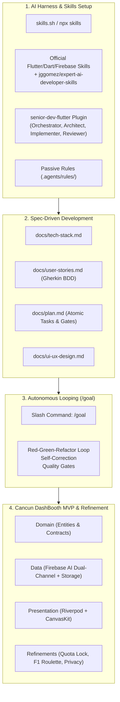

# 🏝️ Lab: Construcción de Cancun DashBooth con AI Harness Engineering, Skills y Looping Autónomo

> **Conferencia:** FlutterConf LATAM Cancún 2026  
> **Proyecto:** Cancun DashBooth (`cancun_dashbooth`)  
> **Plataforma:** Flutter Web (CanvasKit / WebGL / Wasm ready)  
> **Metodología:** Harness Engineering, Agent Skills Standard, Clean Architecture & Autonomous Looping con `/goal`  
> **Repositorio de Skills:** [jggomez/expert-ai-developer-skills](https://github.com/jggomez/expert-ai-developer-skills)  
> **Plugin Especializado:** `senior-dev-flutter`  

---

## 1. Objetivo del Laboratorio

El objetivo de este laboratorio práctico es guiarte **paso a paso** en la concepción, diseño, especificación y construcción completa desde cero de una aplicación Flutter Web de calidad de producción (**Cancun DashBooth**), utilizando un enfoque moderno de **Ingeniería de Harness de Inteligencia Artificial (AI Harness Engineering)**.

Aprenderás a orquestar agentes autónomos mediante bucles de desarrollo (`/goal`), apalancando el catálogo modular de **Agent Skills** (estándar abierto de agentes), el plugin especializado **`senior-dev-flutter`** y una metodología estricta de **Spec-First** impulsada por documentación viva.

---

## 2. Descripción de la Aplicación (Cancun DashBooth)

**Cancun DashBooth** es la aplicación interactiva oficial diseñada para la conferencia FlutterConf LATAM en Cancún, México. Su propósito es ofrecer una experiencia inmersiva y memorable para todos los asistentes del evento:

1. **Captura Web Fluida:** Los asistentes registran su nombre y se toman una selfie directamente desde el navegador web de su teléfono móvil o laptop (sin necesidad de instalar aplicaciones nativas).
2. **Transformación Multimodal con Firebase AI (`gemini-3.1-flash-image`):** La IA de Gemini analiza la fotografía y genera una ilustración caribeña de alta fidelidad donde el asistente aparece celebrando en la playa de Cancún junto a **Dash**, la mascota oficial de Flutter, acompañada de un título o "vibe" festivo (ej. *"Dash Surfista 100%"*).
3. **Credencial Oficial Conmemorativa:** Composición digital en alta definición de la tarjeta de asistente con aspecto de credencial VIP (chip dorado NFC PASS, branding oficial del evento, rol *"Flutter Pioneer"* y hashtag `#flutterconflatam26`).
4. **Descarga HD y Social Sharing:** Descarga nativa como imagen PNG sin distorsión (utilizando `RepaintBoundary` a `pixelRatio: 2.0`) y botón directo para compartir en Instagram Stories con el hashtag copiado automáticamente.
5. **Mural Colaborativo en Tiempo Real (Estrategia Zero-Auth):** Al confirmar su credencial, la imagen se almacena en Firebase Storage y los metadatos se registran en Cloud Firestore sin exigir contraseñas ni login previo. Las fotos aparecen al instante en una pantalla de collage desordenado estilo álbum de fotos con inclinaciones orgánicas.
6. **Sorteo de Premios con Ruleta F1 y Podio:** Un componente interactivo de sorteo de premios estilo Fórmula 1: semáforo de salida de 5 luces rojas, giro a más de 330 km/h durante 10 segundos exactos, desaceleración dramática y revelación de un podio tridimensional de ganadores (P1 Oro 🥇, P2 Plata 🥈, P3 Bronce 🥉).

---

## 3. Lo Que Aprenderás

En este laboratorio dominarás habilidades críticas que diferencian a un desarrollador tradicional de un **Senior AI-Assisted Software Engineer**:

* **Harness Engineering para Agentes de IA:**
  * Cómo estructurar el entorno de trabajo del agente mediante herramientas nativas, servidores MCP (*Model Context Protocol*), reglas pasivas y habilidades modulares (*Agent Skills*).
  * Instalación y configuración de los packs oficiales de Flutter y Dart (`flutter/agent-plugins`, `dart-lang/skills`) y del repositorio especializado de ingeniería [jggomez/expert-ai-developer-skills](https://github.com/jggomez/expert-ai-developer-skills).
  * Cómo instalar y operar el plugin de subagentes `senior-dev-flutter` (Orquestador, Arquitecto, Implementador, Revisor y Release Engineer).

* **Spec-First & Documentación Viva como Memoria de Trabajo:**
  * Por qué redactar especificaciones rigurosas antes de generar código es la mejor inversión para evitar que la IA alucine o tome atajos indeseados.
  * Cómo documentar el Tech Stack justificando cada dependencia, las Historias de Usuario con sintaxis Gherkin BDD y el Plan de Ejecución Maestro con *Quality Gates*.
  * Cómo esta documentación actualizada permite que las iteraciones posteriores de refinamiento sean quirúrgicas y exactas.

* **Autonomous Execution Looping con `/goal`:**
  * Comprender la anatomía del comando `/goal`: formulación de intenciones, bucles de autocorrección, ciclos de Test-Driven Development (Red-Green-Refactor) y condiciones de parada (*Stop Gates*).
  * Observar cómo el agente lee el plan maestro, toma tareas atómicas, ejecuta pruebas automatizadas en background y corrige fallos sin requerir microgestión humana.

* **Arquitectura Limpia en Flutter Web (100% Web-Safe):**
  * Desacoplamiento estricto en tres capas: **Domain** (Dart puro, cero Flutter/Firebase), **Data** (repositorios, fuentes de datos remotas y serialización) y **Presentation** (Riverpod, Material 3, Glassmorphism).
  * Eliminación absoluta de dependencias de `dart:io` (trabajo puro en memoria con `Uint8List`).

* **Integración Avanzada de Firebase sin Fricción:**
  * Uso de **Firebase AI Logic** (`firebase_ai`) con el modelo multimodal `gemini-3.1-flash-image` para salida simultánea de imagen y texto.
  * Implementación de una arquitectura de resiliencia **Dual-Channel** con fallback transparente a la REST API de Google AI Developer ante errores 401 de App Check en Web.
  * Estrategia **Zero-Auth** en Cloud Firestore y Firebase Storage con reglas de seguridad públicas fuertemente tipadas y validadas por esquema.

* **Refinamiento Fino y Robustez de Producto:**
  * Ingeniería de prompts con **Character Anchoring** (garantizando que Dash sea un muñeco de peluche de ave azul y no un pez o delfín).
  * Protección de cuotas de APIs de IA mediante bloqueo post-publicación (`isPublished == true`) y botón hero de reinicio limpio.
  * Política de Cero Datos Ficticios (**Zero-Fake-Data Policy**) eliminando correos inventados.
  * Diseño responsivo universal en CanvasKit erradicando colapsos de shaders y layouts verticales no deseados.

---

## 4. Estructura y Módulos del Laboratorio

Este laboratorio está organizado en 6 módulos secuenciales y auto-contenidos:

| Módulo | Documento | Tema Principal |
| :--- | :--- | :--- |
| **Módulo 1** | [01-harness-and-skills.md](01-harness-and-skills.md) | **Harness Engineering, Skills y Plugin `senior-dev-flutter`:** Configuración del entorno con `skills.sh`, MCP de Dart y reglas del proyecto. |
| **Módulo 2** | [02-spec-and-doc-driven-dev.md](02-spec-and-doc-driven-dev.md) | **Spec-First & Documentación Viva:** Creación de `tech-stack.md`, `user-stories.md`, `plan.md` y `ui-ux-design.md`. |
| **Módulo 3** | [03-looping-con-goal-mvp.md](03-looping-con-goal-mvp.md) | **Demostración de Looping con `/goal` para Construir el MVP:** Funcionamiento del bucle autónomo, prompt maestro y gates de parada. |
| **Módulo 4** | [04-core-implementation-paso-a-paso.md](04-core-implementation-paso-a-paso.md) | **Paso a Paso de la Implementación Core:** TDD en Domain, integración de Firebase AI + Storage Zero-Auth y estado reactivo con Riverpod. |
| **Módulo 5** | [05-refinamiento-iterativo-y-maduracion.md](05-refinamiento-iterativo-y-maduracion.md) | **Refinamiento Iterativo y Lecciones del Pulido:** Protección de cuota IA, prompt de Dash, ruleta F1, Zero-Fake-Data y CanvasKit responsive. |
| **Módulo 6** | [06-verificacion-calidad-y-despliegue.md](06-verificacion-calidad-y-despliegue.md) | **Quality Gates, Testing Sensorial y Despliegue:** Auditoría estática sin warnings, 57 pruebas pasando al 100% y hosting en producción. |
| **Playbook** | [flutter-playbook.md](flutter-playbook.md) | **Flutter Engineering Playbook:** Fundamentos, The Three Trees, DevTools, vocabulario, patrones de diseño, buenas prácticas y catálogo de librerías. |

---

## 5. Prerrequisitos de Entorno

Antes de comenzar con el Módulo 1, asegúrate de contar con las siguientes herramientas instaladas en tu estación de trabajo:

* **Flutter SDK:** Versión `>= 3.29.0` con canal `stable` habilitado para Web (`flutter config --enable-web`).
* **Dart SDK:** Versión `>= 3.7.0` (incluye soporte nativo para `dart mcp-server`).
* **Node.js & npm:** Versión `>= 18.0.0` (requerido para ejecutar `npx skills`).
* **Git:** Para clonar repositorios y versionar el código.
* **Firebase CLI:** Instalado globalmente (`npm install -g firebase-tools`) y autenticado (`firebase login`).
* **Entorno de Agente de IA (Host):**
  * **Google Antigravity (AGY):** CLI oficial con soporte de plugins y subagentes.
  * o **Claude Code:** Con soporte de plugins de agente.

---

## 6. ¡Comencemos!

Dirígete de inmediato al **[Módulo 1: Configuración del Harness, Skills y Plugin `senior-dev-flutter`](01-harness-and-skills.md)** para aprovisionar tus herramientas y arrancar la construcción de Cancun DashBooth.
