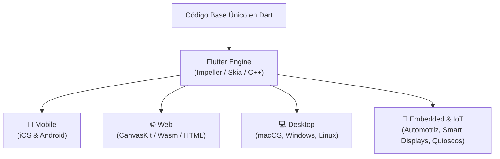
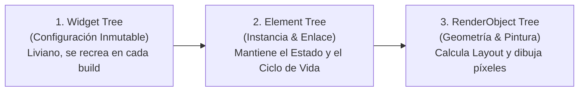

# 📖 Flutter Engineering Playbook: Fundamentos, Arquitectura, Herramientas y Buenas Prácticas

> **Ruta:** `lab/flutter-playbook.md`  
> **Propósito:** Guía de referencia técnica y conceptual para desarrolladores y agentes de IA. Cubre desde qué es Flutter y su motor de renderizado, hasta el vocabulario esencial, herramientas de profiling, patrones de diseño de software, catálogo de librerías recomendadas y buenas prácticas de ingeniería para aplicaciones de producción.

---

## 1. ¿Qué se Puede Hacer con Flutter? (El Universo Multiplataforma)

**Flutter** es el framework de código abierto de Google para crear aplicaciones hermosas, compiladas nativamente y multiplataforma a partir de un **único código base**.

A diferencia de tecnologías híbridas tradicionales (como Cordova o Capacitor) o puentes de JavaScript (como React Native), **Flutter no utiliza componentes de interfaz nativos del sistema operativo ni vistas web (WebViews)**. En su lugar, Flutter incluye su propio motor gráfico de alto rendimiento (**Impeller** en iOS/Android/macOS y **Skia / WebGL / CanvasKit** en Web) que dibuja cada píxel directamente en la pantalla a 60 o 120 cuadros por segundo (FPS).

### Casos de Uso de Alto Impacto
* **Aplicaciones Móviles de Misión Crítica:** Banca, fintech, e-commerce y redes sociales con animaciones fluidas y gestos nativos.
* **Aplicaciones Web Interactivas & PWAs:** Experiencias ricas con gráficos en tiempo real, CanvasKit, WebAssembly (Wasm) y aceleración por hardware.
* **Dashboards y Herramientas de Escritorio:** Aplicaciones multipantalla en Windows, macOS y Linux con soporte para menús nativos, atajos de teclado y periféricos.
* **Photobooths e Interfaces Asistidas por IA:** Como **Cancun DashBooth**, integrando captura en memoria, modelos multimodales (Gemini) y proyección en vivo.
* **Videojuegos 2D e Interactivos:** Creación de juegos con físicas y bucles de renderizado continuo utilizando el motor **Flame**.

---

## 2. Componentes Fundamentales: Widgets y el Árbol de Renderizado

En Flutter, la máxima arquitectónica es: **"Everything is a Widget" (Todo es un Widget)**. Un widget es una declaración inmutable de una parte de la interfaz de usuario.

### 2.1. Los Tres Tipos Fundamentales de Widgets
1. **`StatelessWidget`:** Widget inmutable que no mantiene estado interno cambiante en el tiempo. Su apariencia depende únicamente de los parámetros pasados en su constructor.
2. **`StatefulWidget`:** Widget que delega su apariencia a un objeto mutable `State`. Mantiene el estado a lo largo de los cuadros y se actualiza al invocar `setState()`.
3. **`InheritedWidget`:** Widget especializado que permite propagar datos de forma eficiente hacia abajo en el árbol de widgets sin necesidad de pasarlos manualmente por constructor (es la base sobre la que operan `Theme.of(context)`, `MediaQuery.of(context)` y Riverpod/Provider).

### 2.2. La Trinidad de Flutter: Los Tres Árboles (The Three Trees)
Para lograr un rendimiento sobresaliente, Flutter mantiene internamente tres árboles sincronizados:

* **Widget Tree:** Las instrucciones de diseño declaradas por el desarrollador (`Text`, `Container`, `Row`). Se recrea constantemente con costo despreciable.
* **Element Tree:** Nodos persistentes en memoria que comparan si el nuevo widget es del mismo tipo y clave (`Widget.canUpdate`). Si lo es, reutilizan el nodo existente y actualizan el RenderObject, evitando trabajo innecesario.
* **RenderObject Tree:** Objetos pesados de bajo nivel (`RenderBox`, `RenderFlex`) que calculan tamaños (`layout`), posición relativa y pintan en el lienzo (`paint`).

### 2.3. Categorías de Widgets Esenciales
| Categoría | Widgets Principales | Propósito |
| :--- | :--- | :--- |
| **Layout & Estructura** | `Row`, `Column`, `Stack`, `Flex`, `Wrap` | Organizar elementos horizontal, verticalmente o superpuestos. |
| **Contenedores & Estilo** | `Container`, `DecoratedBox`, `Padding`, `SizedBox`, `BackdropFilter` | Márgenes, colores de fondo, bordes, glassmorphism y dimensiones fijas. |
| **Gráficos & Pintura** | `RepaintBoundary`, `CustomPaint`, `Canvas`, `ClipRRect` | Dibujo vectorial de bajo nivel, aislamiento de capas de rasterización y bordes redondeados. |
| **Listas & Desplazamiento** | `ListView.builder`, `GridView.builder`, `CustomScrollView`, `SliverAppBar` | Listas y cuadrículas infinitas con reciclaje eficiente de elementos fuera de pantalla. |
| **Interactividad** | `GestureDetector`, `InkWell`, `InteractiveViewer`, `IgnorePointer` | Detección de taps, doble tap, arrastre, zoom, o bloqueo de inputs tras publicación. |
| **Asincronía & Animación** | `FutureBuilder`, `StreamBuilder`, `AnimatedBuilder`, `TweenAnimationBuilder` | Renderizado reactivo ante promesas, flujos en tiempo real y transiciones elásticas. |

---

## 3. Herramientas del Ecosistema (Flutter & Dart Tooling)

### 3.1. Herramientas de Línea de Comandos (CLI)
* **`flutter doctor`:** Diagnostica el estado del entorno de desarrollo (Android SDK, Xcode, Chrome, CocoaPods, VS Code).
* **`flutter create --platforms=<plataformas> <nombre>`:** Genera el andamiaje del proyecto limitando las plataformas necesarias.
* **`flutter run -d <dispositivo> --profile`:** Ejecuta la app en modo Profile para medir rendimiento real sin la sobrecarga del modo Debug.
* **`flutter build web --release`:** Compila el bundle de producción para navegadores web optimizando minificación y CanvasKit.
* **`dart analyze --fatal-infos`:** Ejecuta el analizador estático tratando cualquier warning o sugerencia como error fatal.
* **`dart format .`:** Aplica el formato de código estándar oficial de Dart de forma automática.
* **`dart fix --apply`:** Resuelve mecánicamente advertencias de deprecación o sugerencias de lint.

### 3.2. Flutter DevTools Suite
**Flutter DevTools** es el conjunto de utilidades de diagnóstico más potente del ecosistema:
1. **Flutter Inspector:** Permite examinar visualmente el árbol de widgets, depurar layouts desbordados (*overflows* de píxeles amarillos y negros) y activar la guía visual de márgenes.
2. **Performance View (Frame Timing):** Diagnostica problemas de caída de cuadros (*jank*). Separa el tiempo invertido en el hilo de la UI (Dart) vs el hilo Raster/GPU (dibujo de shaders).
3. **Memory View:** Inspecciona la memoria RAM consumida por la aplicación, detecta fugas de memoria (*memory leaks*) por controladores no cerrados y toma snapshots del montículo (Heap).
4. **Network View:** Monitorea todas las peticiones HTTP/REST y conexiones WebSocket en tiempo real.
5. **CPU Profiler:** Muestra *Flame Charts* para identificar funciones o algoritmos lentos que bloquean el hilo de ejecución.

### 3.3. Dart & Flutter MCP Server (`dart mcp-server`)
Integrado nativamente en Dart 3.7+, permite a los agentes de IA conectarse mediante el **Model Context Protocol (MCP)** para inspeccionar el árbol de código, diagnosticar errores de compilación y ejecutar refactorizaciones automatizadas.

---

## 4. Vocabulario & Conceptos Esenciales de Flutter

* **Hot Reload:** Inyecta código Dart modificado en la Máquina Virtual de Dart en ejecución conservando el estado actual de la pantalla en menos de 1 segundo.
* **Hot Restart:** Reinicia la aplicación y restablece el estado a su valor inicial, recargando el código en aproximadamente 2 a 3 segundos.
* **"Constraints go down, Sizes go up, Parent sets position":**  
  La regla de oro del layout en Flutter:
  1. El padre pasa **restricciones** (ancho/alto mínimo y máximo) al hijo.
  2. El hijo determina su propio **tamaño** dentro de esas restricciones y se lo comunica al padre.
  3. El padre determina la **posición** final (coordenadas X, Y) del hijo en pantalla.
* **BuildContext:** Un objeto que representa la ubicación exacta de un widget dentro del árbol de elementos.  
  > ⚠️ **Regla de Oro:** Nunca uses `BuildContext` después de una llamada asíncrona (`await`) sin verificar antes:  
  > `if (!context.mounted) return;`
* **Keys (`Key`):** Identificadores para preservar o distinguir el estado de los widgets cuando cambian de posición o se reconstruyen en una lista (`ValueKey`, `UniqueKey`, `GlobalKey`).
* **RepaintBoundary:** Widget que crea una capa de visualización separada en el motor gráfico. Evita que la animación de un widget hijo provoque que toda la pantalla tenga que volver a pintarse.
* **CanvasKit vs Wasm (Skwasm):**  
  * **CanvasKit:** Motor de renderizado en WebGL/Skia de alta fidelidad gráfica.
  * **WebAssembly (Wasm):** Compilación directa de Dart a binario Wasm que ofrece hasta 3x mejor rendimiento y menor consumo de CPU en navegadores modernos.

---

## 5. Patrones de Diseño Recomendados en Flutter

### 5.1. Clean Architecture Desacoplada
Separa el sistema en capas concéntricas con flujo de dependencias hacia adentro:
* **Domain:** Reglas de negocio puras, entidades inmutables y contratos abstractos (sin dependencias de Flutter ni de Firebase).
* **Data:** Implementación de repositorios, clientes HTTP, fuentes de datos de Firebase y serialización (DTOs).
* **Presentation:** Manejo de estado reactivo (Riverpod), temas, widgets y pantallas.

### 5.2. Repository Pattern
Oculta el origen de los datos a la capa de presentación. La UI interactúa con una interfaz (`IUserCardRepository`), permitiendo alternar entre Firestore, una base de datos local SQLite o mocks de pruebas sin alterar la interfaz gráfica.

### 5.3. State Management Patterns
* **Riverpod (Recomendado):** Gestión de estado declarativa, segura en tiempo de compilación y sin dependencias de `BuildContext`. Maneja estados asíncronos mediante `AsyncValue` (`loading`, `data`, `error`) y streams en vivo mediante `StreamProvider`.
* **BLoC / Cubit:** Flujo unidireccional estricto basado en Streams de eventos de entrada y emisión de estados inmutables.
* **Signals:** Reactividad de grano fino inspirada en SolidJS, minimizando el alcance de reconstrucción al nodo exacto que cambia.

### 5.4. Mapper & Factory Pattern
Transforma modelos de infraestructura (como `DocumentSnapshot` de Firestore) a entidades inmutables de dominio mediante métodos estáticos de conveniencia (`UserCardModel.fromFirestore`).

---

## 6. Buenas Prácticas de Ingeniería (Senior Guidelines)

1. **Minimizar el Rebuild Scope (Alcance de Reconstrucción):**  
   * ❌ **Antipatrón:** Crear funciones dentro de la clase de la pantalla: `Widget _buildProfile() { ... }`. Cada vez que la pantalla cambia, toda la función se ejecuta de nuevo.
   * ✔️ **Buena Práctica:** Extraer componentes dedicados heredando de `StatelessWidget` o `ConsumerWidget`. De esta forma, Flutter solo reconstruye el sub-árbol que realmente cambió.
2. **Uso Extensivo de `const`:**  
   Colocar `const` en constructores de widgets estáticos le indica a Flutter que ese widget nunca cambiará, permitiendo al Element Tree omitir su evaluación por completo durante un frame.
3. **Cero `dart:io` en Aplicaciones Web:**  
   Para garantizar compatibilidad universal con navegadores, procesa imágenes y archivos binarios exclusivamente como buffers en memoria: **`Uint8List`**.
4. **Liberación Obligatoria de Recursos en `dispose()`:**  
   Todo `TextEditingController`, `AnimationController`, `ScrollController` o suscripción de Stream debe ser cancelado o cerrado en el método `dispose()` del estado para prevenir fugas de memoria.
5. **Uso de `RepaintBoundary` para Exportación de Imágenes:**  
   Al capturar credenciales o widgets a imágenes PNG, utiliza un `RepaintBoundary` configurado con `pixelRatio: 2.0` para evitar pixelado en pantallas Retina y de alta densidad.
6. **Pirámide de Testing Automatizado:**  
   * **Unit Tests (Capa Domain/Data):** Pruebas veloces con `package:test` y `mocktail`.
   * **Widget Tests (Capa Presentation):** Pruebas de interacción y renderizado con `WidgetTester`.
   * **Integration Tests (E2E):** Pruebas de flujos de usuario completos en navegadores o dispositivos reales.

---

## 7. Catálogo de Librerías Más Recomendadas (`pub.dev`)

| Categoría | Paquete | Por Qué Usarlo |
| :--- | :--- | :--- |
| **Manejo de Estado** | `flutter_riverpod` | Inyección de dependencias segura, sin boilerplate de `BuildContext`, ideal para arquitecturas limpias. |
| **Enrutamiento** | `go_router` | Enrutamiento declarativo oficial con soporte completo de Deep Linking y navegación Web. |
| **Red & APIs** | `dio` / `http` | Clientes HTTP con interceptores, reintentos automáticos, soporte de FormData y cancelación de peticiones. |
| **Firebase Cloud** | `firebase_core`, `cloud_firestore`, `firebase_storage` | Integración oficial con la infraestructura Cloud de Google. |
| **IA Generativa** | `firebase_ai` | SDK oficial de Firebase para interactuar con Gemini (`gemini-3.1-flash-image`, `gemini-1.5-flash`). |
| **Modelos & Inmutabilidad** | `freezed` / `equatable` | Generación de clases de datos inmutables, `copyWith`, uniones discriminadas y comparación por valor. |
| **Tipografía & Estilo** | `google_fonts` | Carga optimizada de tipografías web y móviles con caché local automático. |
| **Animaciones & Feedback** | `shimmer`, `flutter_animate` | Efectos visuales de carga modernos y micro-animaciones fluidas. |
| **Multimedia Web-Safe** | `image_picker`, `image`, `universal_html` | Selección de fotos y manipulación de bytes en memoria compatible con Web. |
| **Testing & Mocks** | `mocktail` | Creación de dobles de prueba y mocks con sintaxis limpia sin generación de código. |

---

## 8. Referencias Oficiales y Recursos de Aprendizaje

* 🌐 **Documentación Oficial de Flutter:** [flutter.dev](https://flutter.dev)
* 🌐 **Portal Oficial del Lenguaje Dart:** [dart.dev](https://dart.dev)
* 📦 **Repositorio Oficial de Paquetes:** [pub.dev](https://pub.dev)
* 🤖 **Estándar Abierto de Agent Skills:** [agentskills.io](https://agentskills.io)
* 🛠️ **Skills de Ingeniería Avanzada de @jggomez:** [github.com/jggomez/expert-ai-developer-skills](https://github.com/jggomez/expert-ai-developer-skills)
* 📺 **Canal de YouTube Oficial de Flutter:** Series *Widget of the Week* y *Decoding Flutter*.

---

### ¡Aplica este Playbook en todos tus proyectos y lleva tu ingeniería en Flutter al más alto nivel! 💙🚀
